# `第４回課題`
## 課題
### AWS 上に新しく VPC を作ってください。
### EC2 と RDS を構築してください。
### EC2 から RDS へ接続し、正常であることを確認して報告してください。
 
 
 

## 用語
### [Amazon VPC( Virtual Private Cloud )](https://docs.aws.amazon.com/ja_jp/vpc/latest/userguide/what-is-amazon-vpc.html)
Amazon Virtual Private Cloud (Amazon VPC) を使用すると、論理的に隔離されている定義済みの仮想ネットワーク内で AWS リソースを起動できます。仮想ネットワークは、お客様自身のデータセンターで運用されていた従来のネットワークによく似ていますが、AWS のスケーラブルなインフラストラクチャを使用できるというメリットがあります。

### [仮想プライベートクラウド (VPC)](https://docs.aws.amazon.com/ja_jp/vpc/latest/userguide/configure-your-vpc.html)
仮想プライベートクラウド (VPC) は、AWS アカウント専用の仮想ネットワークです。VPC は、AWS クラウドの他の仮想ネットワークから論理的に切り離されています。VPC 内には、Amazon EC2 インスタンスなどの AWS リソースを起動できます。

アカウントには、各 AWS リージョンのデフォルト VPC が含まれています。また、追加の VPC を作成することもできます。

### [Amazon EC2( Amazon Elastic Compute Cloud )](https://www.itechh.ne.jp/blog/column/ec2-explain.html)
Amazonが提供する「仮想サーバサービス」です。EC2を利用することで、従来のような物理サーバの構築や環境構築作業をすることなく、手軽に仮想サーバを用意することができます。  
EC2の代表的な機能にはインスタンス、セキュリティグループ（仮想ファイアウォール）、セキュアなログイン管理機能がある。  
メリットとしては、サーバの構築や運用にかかる時間を削減、状況に合わせたスペック変更ができる、従量課金制により費用を抑制、簡単に仮想サーバの冗長化が可能が挙げられる。

### [Amazon RDS( Amazon Relational Database Service )](https://aws.amazon.com/jp/rds/)
Amazon Relational Database Service (Amazon RDS) は、クラウド内でデータベースのセットアップ、運用、およびスケールを簡単に行うことのできるマネージド型サービスの集合体です。MySQL との互換性を持つ Amazon Aurora、PostgreSQL との互換性を持つ Amazon Aurora、MySQL、MariaDB、PostgreSQL、Oracle、SQL Server の 7 つの人気エンジンから選択し、Amazon RDS on AWS Outposts でオンプレミスデプロイが可能です。

### インスタンス
インスタンスとは、AWS上で稼働する仮想サーバのことを指し、仮想サーバを数える際の単位としても使われます。AWSでは仮想サーバのCPUやメモリなどの組み合わせがインスタンスタイプとして定義されています。必要なスペックに応じたインスタンスタイプを選択し、OS、ストレージ容量などを決定してインスタンスを作成します。また、インスタンスの負荷状況に応じて自動的にインスタンスをスケールアウト（台数増）／イン（台数減）することが可能なオートスケーリングなど、用途に合わせた柔軟な運用が可能です。

### セキュリティグループ（仮想ファイアウォール）
EC2では、セキュリティグループという仮想ファイアウォール機能が備わっています。セキュリティグループによってインスタンスに入出力される通信を制御することで、セキュアな通信を実現します。

### セキュアなログイン管理機能
インスタンスへのログイン情報を公開鍵暗号方式で管理できます。公開鍵暗号方式とは公開鍵と暗号鍵の二種類の鍵を使用し通信の暗号化・複合化を行う方式のことです。パスワードのみの認証よりもセキュリティが高いため、Amazonより利用が推奨されています。

### [サブネット](https://docs.aws.amazon.com/ja_jp/vpc/latest/userguide/configure-subnets.html)
サブネットは、VPC の IP アドレスの範囲です。特定のサブネットには、EC2 インスタンスなどの AWS リソースを作成できます。

### [ルートテーブル](https://docs.aws.amazon.com/ja_jp/vpc/latest/userguide/VPC_Route_Tables.html)
ルートテーブルには、サブネットまたはゲートウェイからのネットワークトラフィックの経路を判断する、ルートと呼ばれる一連のルールが含まれます。

ルーティングはルートテーブルを使用して、サブネットやゲートウェイからのネットワークトラフィックの転送先を指定します。

### [ゲートウェイ](https://docs.aws.amazon.com/ja_jp/vpc/latest/userguide/extend-intro.html)
仮想プライベートクラウド (VPC) を他のネットワークに接続できます。他の VPC、インターネット、オンプレミスのネットワークはその一例です。
インターネットゲートウェイは、VPC とインターネットとの間の通信を可能にする VPC コンポーネントであり、冗長性と高い可用性を備えており、水平スケーリングが可能です。
VPC エンドポイントを使用すると、インターネットゲートウェイや NAT デバイスを使用せずに、プライベートで AWS のサービス に接続できます。

### テナンシー  
テナンシーは、EC2 インスタンスが物理ハードウェアに分散される方法を定義します。これは、料金に影響を与えます。次の 3 つのテナンシーオプションを使用できます。
- 共有 (default) — 複数の AWS アカウント が、同じ物理ハードウェアを共有できます。
- ハードウェア専有インスタンス (dedicated) — インスタンスはシングルテナントのハードウェアで実行されます。
- 専有ホスト (host) — インスタンスは、EC2 インスタンスのキャパシティー全体が専用に設定された物理サーバーで実行されます。専有ホストとは、ユーザーが設定を制御できる隔離サーバーです。

### 冗長性
無駄そうなのに、メリットとして書かれているので調べた。
通信やインフラでは、万が一のときに備えて付加した余裕のこと。問題が起きても他でカバーできる状態のことをいう。

 
 
 

## 予想
このままコピペしても情報迷子になって、あまり意味がないと思うので、間違えて理解しているかもしれないが、理解した範囲でまとめる。  
ユーザーはサーバー等のインフラストラクチャ（インフラ）を用意する必要なく、Amazonが提供するサービスを使用してインフラを構築できる。このインフラは拡張性が高いというメリットを持っている。
手順としては  
VPCの作成（ネットワークの構築） → EC2の利用（サーバ環境の構築） → EC2を分割（サブネットの作成） → インスタンスの作成(仮想サーバのスペックを決めてサブネットに配置) → ルーティング（VPCを他のネットワークに接続）  

## VPCの作成手順
手順１  
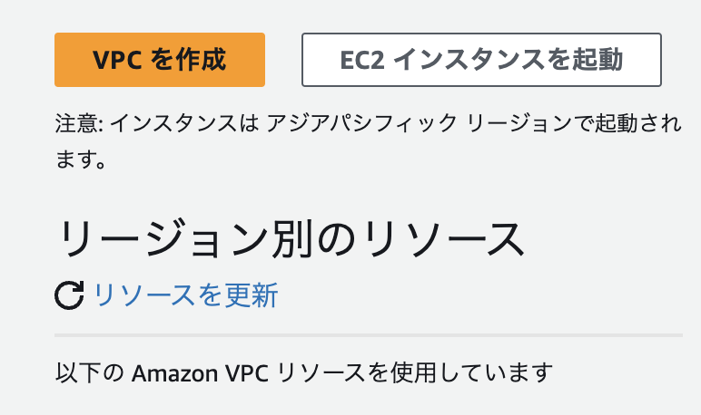

VPCを作成をクリック

手順２  

画像のようにすると  
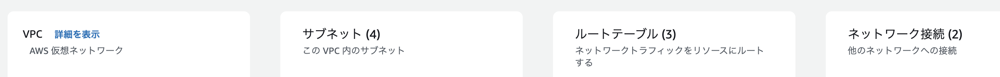

自動でサブネット、ルートテーブル、ネットワーク接続をやってくれる 

手順３  
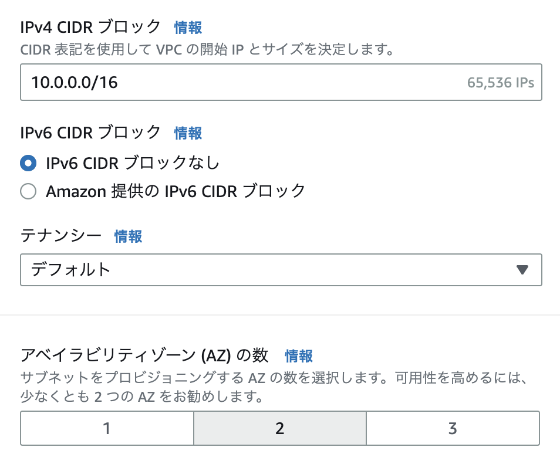

何もいじらない  

手順４  
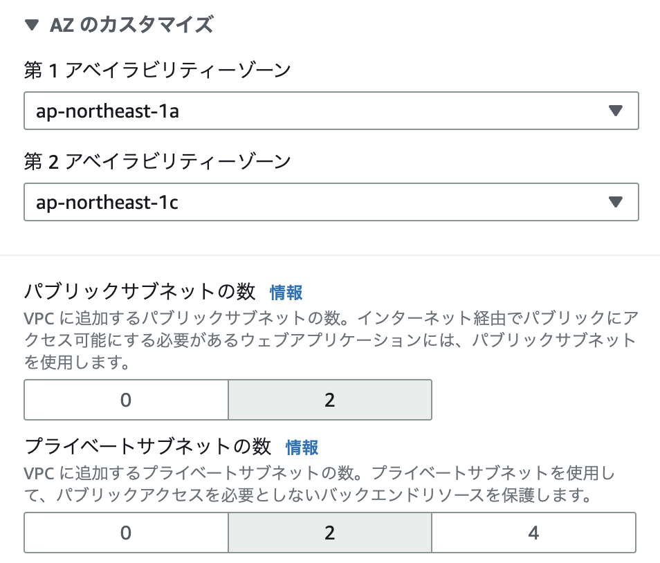

何もいじらない  

手順５  
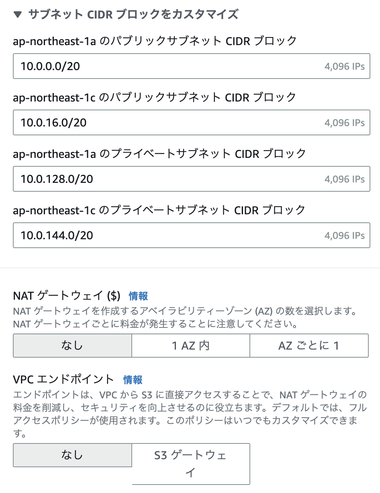

VPC エンドポイントをなしに変更  
VPC エンドポイントを使用すると、VPC を [Amazon S3](https://aws.amazon.com/jp/s3/) (Amazon Simple Storage Service) などのサポート対象の AWS サービスにプライベートに接続できます。  
使っても無料なのでそのままで構わないらしいが、スライド資料に合わせてなしに設定する。  

手順６  
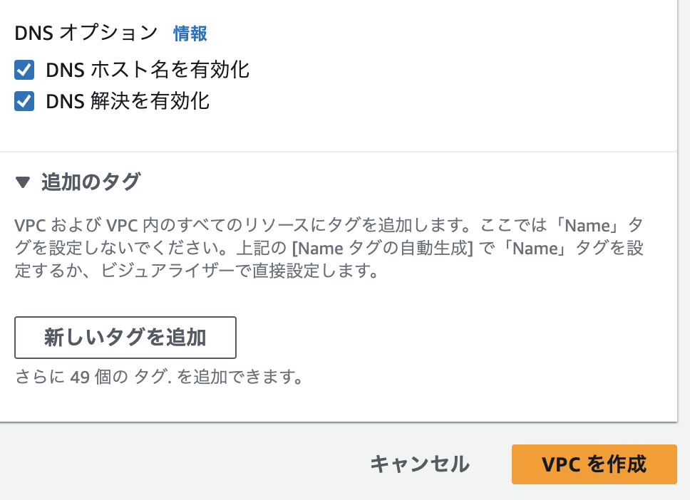

何もいじらすにVPCを作成をクリック
  
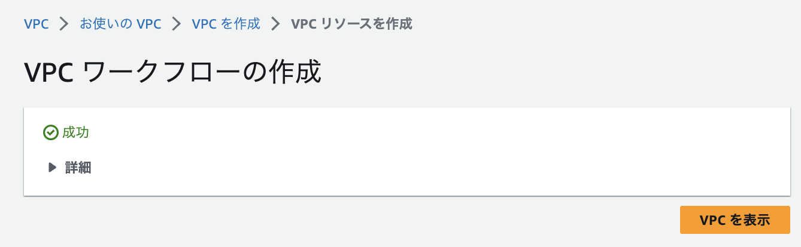  
下のような項目にアドレスのようなものが書かれたものが出てくるが、まだ何が良くて何が悪いのかわからないめスクショは控えておく
- VPC を作成:  
- DNS ホスト名を有効化
- DNS 解決を有効化
- VPC 作成の確認:  
- サブネットを作成: 
- サブネットを作成:  
- サブネットを作成:  
- サブネットを作成:  
- インターネットゲートウェイの作成:  
- インターネットゲートウェイを VPC にアタッチ
- ルートテーブルを作成:   
- ルートを作成
- ルートテーブルを関連付ける
- ルートテーブルを関連付ける
- ルートテーブルを作成:  
- ルートテーブルを関連付ける
- ルートテーブルを作成: 
- ルートテーブルを関連付ける
- ルートテーブルの作成を検証中

VPCとサブネット、[IGW](https://docs.aws.amazon.com/ja_jp/vpc/latest/userguide/VPC_Internet_Gateway.html)（インターネットゲートウェイ）が自動生成されたらしい。
録画授業でも行っていたが、クリックするだけで何の実感もなく作れてしまった。

でもこんなに細かくやったことを表示してくれるとは思わなかった。  
VPC の作成と確認（この中で DNS の設定） → サブネットを４つ作成 → IGW の作成 → IWG を VPC にアタッチ → ルートテーブルを作成 → ルートを作成 → ルートテーブルを関連づけて検証  
当たり前だけど、予想とは違った。  

## EC2 インスタンスの作成手順
手順１  
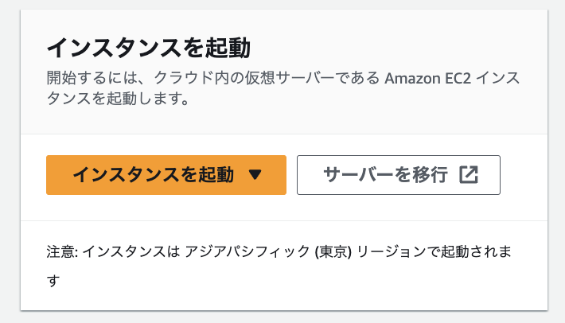

インスタンスを起動をクリック

手順２  
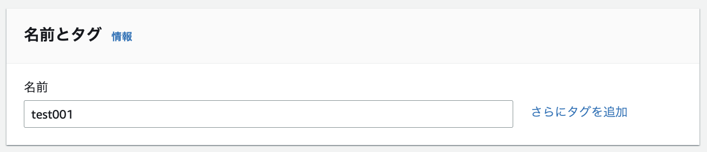

名前を入力する。

手順３  
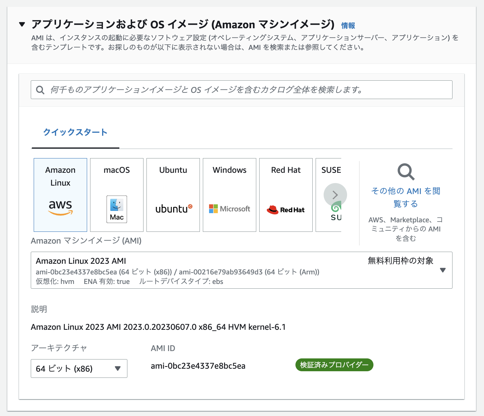

無料利用枠の対象であることを確認。特に何もいじらない。

手順４  
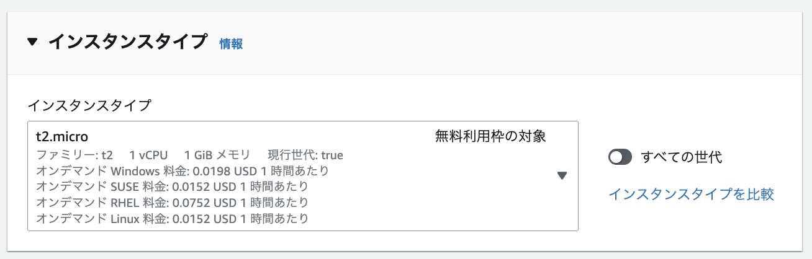

無料利用枠の対象であることを確認。特に何もいじらない。

手順５  
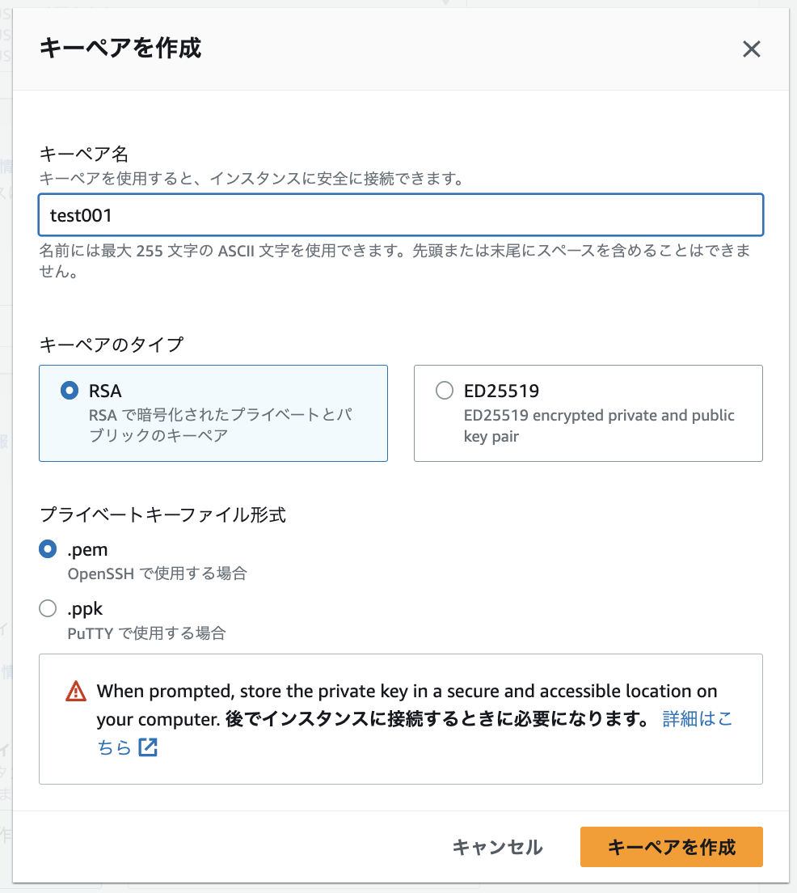

キーペアを作成する。名前とタイプとファイル形式が選択できる。
タイプはキーペアの種類を決められるらしい。
キーペアを作成 をクリックすると選んだファイル形式(拡張子)で保存される。
正直、わからないので特に何もいじらない。

手順６  

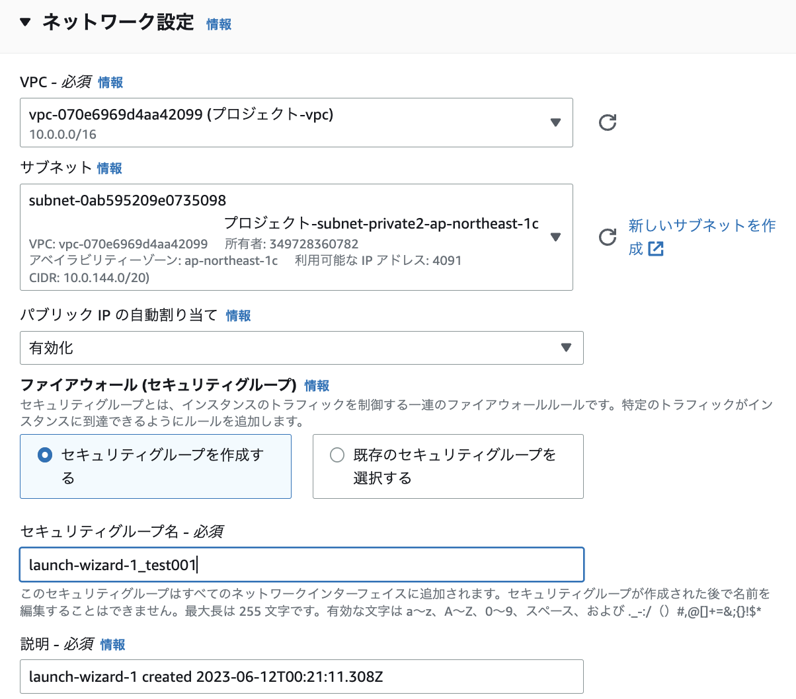

作成したVPCを選択  
パブリック IP の自動割り当てを有効化する  
セキュリティグループは名前だけ変えた。特に何もいじらない。

手順７  

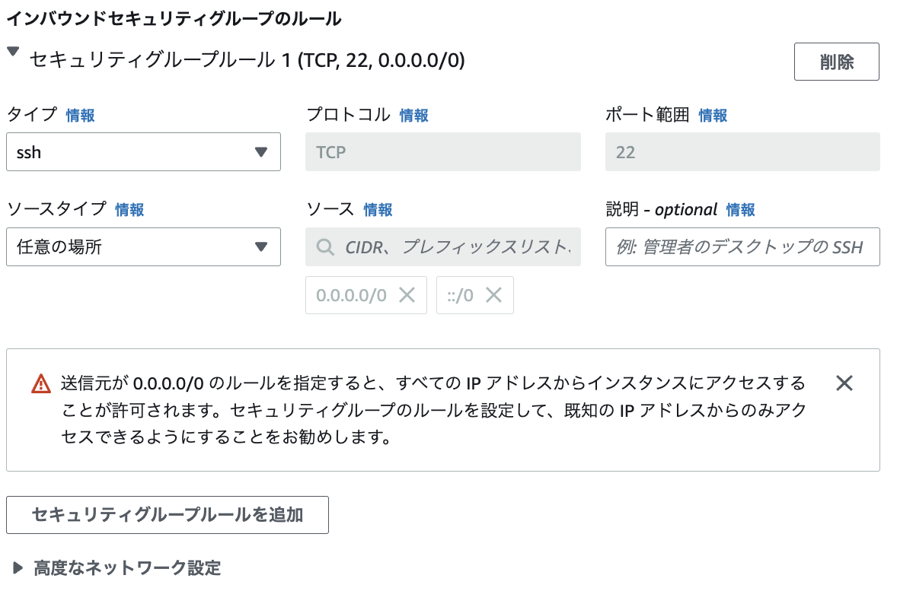

特に何もいじらない。

手順８  

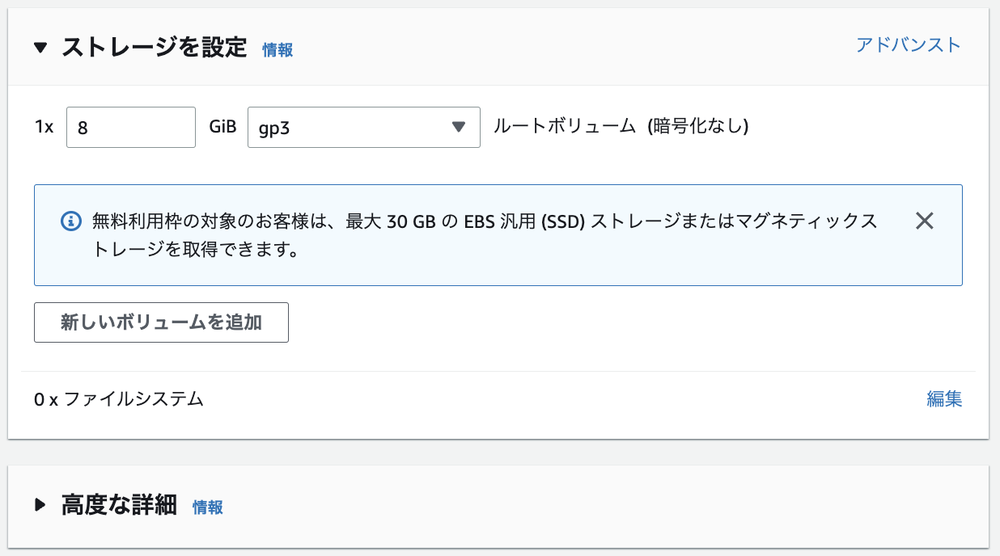

特に何もいじらない。

手順９  

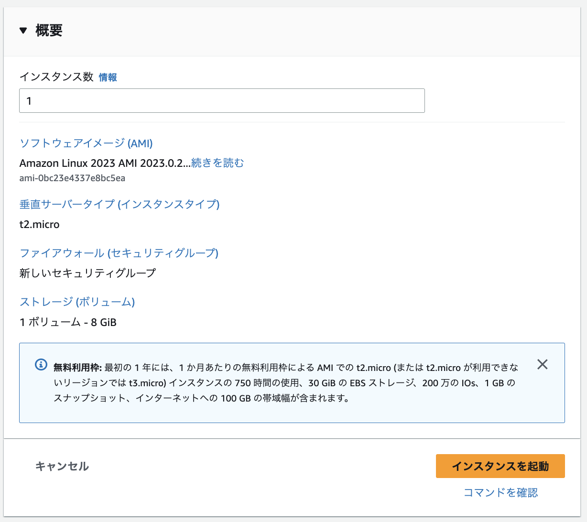

特に何もいじらない。インスタンスを起動をクリック

 
 
 
 
 
 