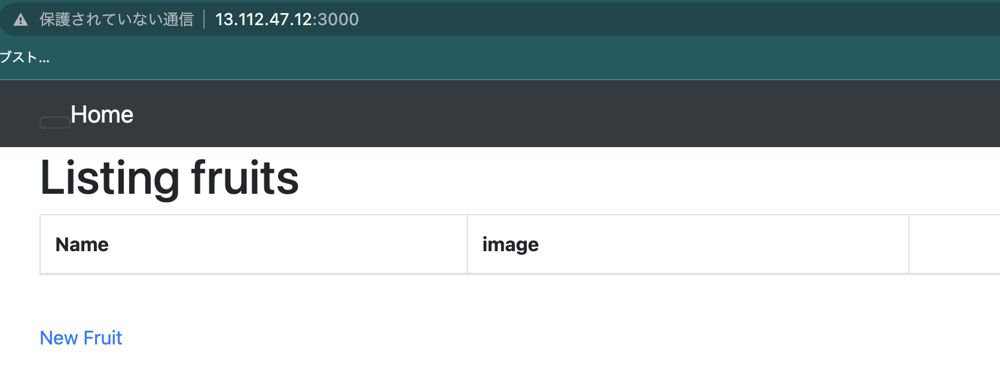

# `第５回課題`
## 課題
- EC2 上にサンプルアプリケーションをデプロイする
  - 第 3 回で使用したサンプルアプリケーションを使う
  - Puma(組み込みサーバー)だけで動作させる
<br/>
<br/>
<br/>

## 前提条件
前提条件として、セキュリティグループの設定で、SSH (ポート 22)、HTTP (ポート 80)、HTTPS (ポート 443)、カスタム TCP (ポート 3000)からの接続を有効にする必要がある
<br/>
<br/>
<br/>

## EC2インスタンスにログイン [参考](https://docs.aws.amazon.com/ja_jp/AWSEC2/latest/UserGuide/AccessingInstancesLinux.html)
lecture04で作成しダウンロードしたキーペアを.ssh/に移動する  
```sh
mv Downloads/[キーペア名.pem] .ssh/
```
EC2にログインする  
```sh
cd .ssh
ssh -i [キーペア名.pem] ec2-user@[パブリック IPv4 DNS]
```
ssh コマンドオプション -i：接続に使用する公開鍵ファイルを指定する  

Are you sure you want to continue connecting (yes/no/[fingerprint])?  
と聞かれるのでyesを入力する  

ログアウトはexitでできる

### ログインできない時は  
#### 権限の設定 [参考](https://docs.aws.amazon.com/ja_jp/AWSEC2/latest/UserGuide/connection-prereqs.html)
ログインは自分以外のユーザーが読み込むことができないように権限を変更していないとできない  
(ls コマンドにオプション -l をつけて実行すると権限がどうなっているのか確認できる)  
```sh
sudo chmod 400 ~/.ssh/[キーペア名.pem]
```
400 は自分４、グループ０、他人０の意味  
４は２進数で100　読み込み１、書き込み０、実行０の意味  

#### パブリック IPv4 DNSが表示されない
[パブリック IPv4 DNS] はVPCの設定項目にある [DNS 設定] の [DNS ホスト名を有効化] にチェックが入っていないと表示されない  

#### その他
ec2-userはユーザー名なので変更している場合はそこも変える必要がある。変更してないので調べてない    

## EC2 上にサンプルアプリケーションをデプロイする
### gitのインストール
各種パッケージをアップデート
```sh
sudo yum update -y
```
オプション -y：インストール時にレスポンスがあったらyと答える

git をインストール
```sh
sudo yum install git -y
```

確認
```sh
git version
```

<br/>
<br/>
<br/>
[参考](https://zenn.dev/tmasuyama1114/articles/ec2-linux-git-install)

### EC2インスタンスのボリュームサイズを変更
[lecture03.md](../lecture03/lecture03.md)の手順でボリュームサイズを8→16に変更する。
<br/>
<br/>
<br/>

### MySQL8.0をインストール
確認
```sh
mysql --version
```
前回から気付いてはいたが、作成時にエンジンのオプションの項目でMySQLを選択したのになぜかMariaDBが入っている

MySQL8.0.33 をインストール
```sh
curl -fsSL https://raw.githubusercontent.com/MasatoshiMizumoto/raisetech_documents/main/aws/scripts/mysql_amazon_linux_2.sh | sh
```

確認
```sh
mysql --version
```

<br/>
<br/>
<br/>

### sampleアプリがデータベースを使えるようにする
configディレクトリに入って
```sh
cp database.yml.sample database.yml
```
database.yml.sample が database.yml という名前でコピーされる

コピーされたdatabase.yml を編集する
```sh
vi database.yml
```
development とtest のsocket の項目を  
「/tmp/mysql.sock」→「/var/lib/mysql/mysql.sock」に変更

パスワードの項目に mysql のパスワードを入力
[esc]→:wq
<br/>
<br/>
<br/>

### rvm と ruby のインストール
呪文  
```sh
sudo gpg --keyserver keyserver.ubuntu.com --recv-keys 409B6B1796C275462A1703113804BB82D39DC0E3 7D2BAF1CF37B13E2069D6956105BD0E739499BDB
```

```sh
\curl -sSL https://get.rvm.io | bash -s stable
```

```sh
rvm get stable
```
ruby をインストール
```sh
rvm install 3.1.2
```

[参考](https://rvm.io/rvm/security)
<br/>
<br/>
<br/>

### npm と yarn のインストール
ノードバージョンマネージャー (nvm) をインストール
```sh
curl -o- https://raw.githubusercontent.com/nvm-sh/nvm/v0.39.3/install.sh | bash
```

nvm を有効にする
```sh
. ~/.nvm/nvm.sh
```

nvm を使用して Node.js の最新バージョンをインストールする
```sh
nvm install --lts
```

Node.js が正しくインストールされ、実行されていることをテストする
```sh
node -e "console.log('Running Node.js ' + process.version)"
```

Node v17.9.1 をインストール
```sh
nvm install 17.9.1
```

yarn をインストール
```sh
npm install --global yarn
```

確認
```sh
yarn --version
```


[参考](https://docs.aws.amazon.com/ja_jp/sdk-for-javascript/v2/developer-guide/setting-up-node-on-ec2-instance.html)
<br/>
<br/>
<br/>

### sample アプリの動作環境
ここまでで、以下の環境が整っているか確認する。  
```sh
ruby -v
```
ruby：3.1.2  
```sh
bundler -v
```
Bundler：2.3.14  
```sh
rails -v
```
Rails：7.0.4  
```sh
node -v
```
Node：v17.9.1  
```sh
yarn -v
```
yarn：1.22.19
<br/>
<br/>

#### 注意
ここまでの方法だと、Nodeとyarnはインスタンスを停止するたびになぜか消えるので特に注意する  
ログインするたび下記コマンドを実行する必要がある
```sh
nvm install 17.9.1
```
<br/>
<br/>
<br/>

### rails 環境のセットアップbin/setup を実行する。
```sh
bin/setup
```
> == Installing dependencies ==

> == Preparing database ==

> == Removing old logs and tempfiles ==

> == Restarting application server ==

これらが出てくればセットアップ完了

> == Command なんか failed ==

が出てきたら なんか が入っていなかったり、設定されていないので、その部分を確認する。  
なんか には bin/yarn や bin/rails db:prepare が入る（他にもある）
<br/>
<br/>
<br/>

### Pumaの起動
bin/dev を実行する
```sh
bin/dev
```
ターミナルを新規にもう一つ立ち上げて netstat コマンドを実行すると、ネットワークの接続状況や状態が確認できる。
```sh
sudo netstat -anp | grep 3000
```
-a：全て表示  
-n：外部アドレスをIPアドレスで表示　プロトコルではなくポート番号で表示  
-p：プロトコルを指定して表示  
| ：[Shift] + ¥ で入力できる。一般的な読み方はパイプで、正式名称はパイプライン。Linuxコマンドを使って標準出力された内容を次のコマンドへ橋渡し（パイプライン処理）する際に使う。
grep 3000：grep コマンドで3000を検索する  

アドレスバーに(EC2インスタンスの)[パブリック IPv4 アドレス] : 3000を入力すると接続できる。  
例）http://xx.xx.xx.xx:3000（xx.xx.xx.xxがパブリック IPv4 アドレス）

[パブリック IPv4 DNS] : 3000でもできるが、その場合は課題３と同じようにconfig/environments/development.rbを編集する必要がある  
  
起動できた
<br/>


<div style="text-align: center;">

[次へ](./lecture05-2.md)

</div>