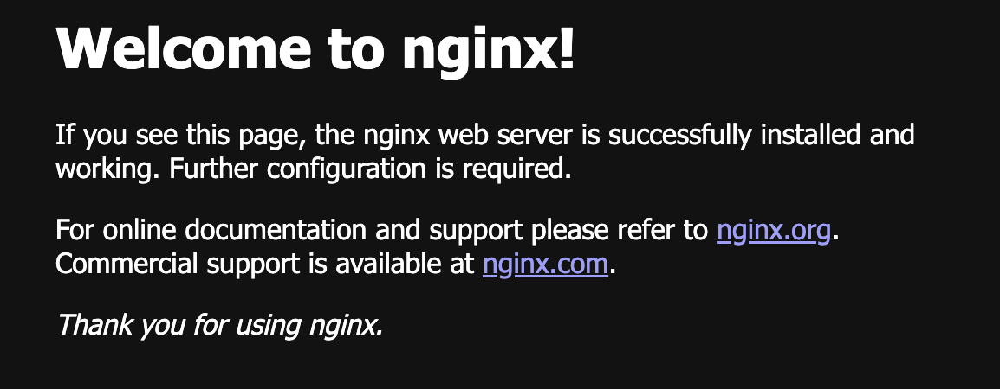

# `第５回課題（２）`
## 課題
- EC2 上にサンプルアプリケーションをデプロイする
  - 第 3 回で使用したサンプルアプリケーションを使う
  - Nginx-Pumaで動作させる
  - Nginx-Unicornで動作させる
- 構成図を書く
<br/>
<br/>

## 全体の流れ
1. Nginxのインストール
- Nginx-Puma
  1. puma.rbの編集(ソケットの作成)  
  1. Nginxの設定(ソケットを参照)  
  1. Nginxのリロード(設定の反映)
- Nginx-Unicoren
  1. unicorn.rbの編集(ソケットの作成)  
  1. Nginxの設定(ソケットを参照)  
  1. Nginxのリロード(設定の反映)
<br/>
<br/>

## はじめに
lecture05-1の段階では学習の都合上、把握しやすいように、最小構成になるようパブリックサブネットとプライベートサブネットを異なるAZ（aとd）に配置していた。  
  
しかし、機能に加わってくるELBはサーバーの負荷を分散させる用途で用いられる機能で、基本的にふたつ以上のEC2が使われる。EC2がひとつの時でも使われることがあるが、それは将来的に拡張を考慮した構成であるべきであり、拡張性を考えるのなら、ねじれたような今の構成は気持ちが悪い。  
なので、パブリックサブネットとプライベートサブネットを同じAZ内（aとa）に配置した。それに伴ってRDS仕様の都合上、空のサブネットを持つAZ（d）を作成した。RDSのサブネットグループは３つあるサブネットのうち、パブリックサブネットを除いた２つからなる。  
  
具体的にはAZ-a内の10.0.10.0/24をパブリックサブネット、10.0.20.0/24をプライベートサブネットとし、拡張する場合は別のAZ-cを作成して10.0.11.0/24をパブリックサブネット、10.0.21.0/24とすればわかりやすいかなと考えた。  

### RDSについて
lecture05-1のサブネット構成を変更するにあたって、RDSを削除して作り直した。  
その過程で、**RDSが課金されないように停止していることを忘れていたのにも関わらず**サンプルアプリケーションが動作していたことに気づいた。これにより**使用しているデータベースがRDSを使っていない**ことが判明した。

lecture03でよくわからないままにしていた datebase.yml について調べる必要が出てきたので調べたら default を変更する必要があるらしいので編集した。  

### datebase.ymlの変更箇所
- username を root から admin へ変更
- host: RDSのエンドポイント を追加

  

その他、EC2上のMySQLのパスワードをRDSのパスワードと同じものにしてしまっていたので、変更した。  
!(datebase.yml)[images/db/5-2/2.png]  
RDSのデータベースが使えるようになった。
<br/>
<br/>
<br/>
## 本編
## Nginxのインストール
amazon-linux-extrasがインストールされているか確認する
```sh
which amazon-linux-extras
```
されていなければ下記コマンドを実行する
```sh
sudo yum install -y amazon-linux-extras
```
利用可能なトピックを表示する
```sh
amazon-linux-extras
```
目的のトピックを有効にする。今回はnginx1
```sh
sudo amazon-linux-extras install -y nginx1
```
確認
```sh
nginx -v
```
初期設定ファイルのバックアップ
```sh
sudo cp -a /etc/nginx/nginx.conf /etc/nginx/nginx.conf.back
```
インスタンス起動時にNginxの自動起動有効
```sh
sudo systemctl enable nginx
```
サービスステータス表示  
Nginxの起動
```sh
sudo nginx
```
パブリック IPv4 アドレス　をアドレスバーに入れるとWelcome to nginx!がみられる。  
  
<br/>
<br/>

### Nginxメモ
etc/nginx/nginx.conf はNginxの設定ファイル  
```sh
http {
	略
	 server {
		略
		root         /usr/share/nginx/html;
	}
}
```
rootに書かれているパスの場所を参照して、そこにあるindex.html ファイルを参照して表示している。  
  
少し書き加えてみた。    
日本語を表示するにはheadの中に
```sh
 <meta charset="UTF-8">
```
を追加する必要がある。
<br/>
<br/>
<br/>

## Pumaの設定
ここでは、NginxとPumaを接続するために必要なソケットを生成するための設定を行う。  
この際、ソケットがhomeより下に置いてあるとNginxと接続できない。  

AWSにログインすると /home/ec2-user にいる。  
サンプルアプリを /home/ec2-user の下で gitclone していた場合、サンプルアプリの置かれている場所がhomeより下になっている。  

```sh
sudo mv raisetech-live8-sample-app/ /opt
```  
ソケットがhomeより上にあればいいので、サンプルアプリごと動かす必要はないらしいが、homeの下に置く必要もないので、参考にしたサイトと同じようにサンプルアプリごと動かした。optに置いていたため、optに置いた。(optはアプリケーションをおくディレクトリ)  

これから編集する/opt/raisetech-live8-sample-app/config にあるpuma.rbの初期設定をバックアップしておく。
```sh
sudo cp -a config/puma.rb config/puma.rb.back
```

puma.rb を 編集する。(sudo vim)

> bind "unix:///home/ec2-user/raisetech-live8-sample-app/tmp/sockets/puma.sock"

上記を下記に変更するとその位置にソケットが生成される。

> bind "unix:///opt/raisetech-live8-sample-app/tmp/sockets/puma.sock"

このソケットが生成される位置さえhomeより上であれば良いため、アプリをhomeより下に置きたい場合はソケットの生成場所を/tmp/sockets/とかに設定すれば良い。（tmpは一時的にデータを保存する場所）

下記コマンドで実行すると
```sh
rails s
```
 > * Listening on unix:///opt/raisetech-live8-sample-app/tmp/sockets/puma.sock

と表示される。  
起動中にその場所へ見に行くとpuma.sockが生成されていることが確認できる。  
停止すると勝手に消える。  
<br/>

### Puma設定に関するその他
> port ENV.fetch("PORT") { 3000 }

をコメントアウトしなければいけないみたいな記事もあるが、コメントアウトしなくてもできた。  
その記事内でNginxのバグかもと書かれていたので、修正されたのかも？  

追記：Nginxを使用する際、ポート3000は使わない気がしたので、セキュリティグループで開けていたポート3000を削除したところ、問題なく接続できたため、こちらも開ける必要がないのでコメントアウトした。  

ソケットが生成される箇所を指定する際に
> bind "unix:///opt/raisetech-live8-sample-app/tmp/sockets/puma.sock"

ではなく

> unix://#{Rails.root}/tmp/sockets/puma.sock

でもいける。  
質問したら式展開と呼ばれることがわかった。  
調べたらruby特有の記述らしく、いま必要な知識というわけでもないので調べるのをやめた。  
どこかに定義されていると思われる。  
<br/>
<br/>
<br/>

## Nginxの設定  
Nginxは、「Nginx全体に関する設定」と「アプリごとに行う設定」がある。  

 /etc/nginx/ にある nginx.conf でNginx全体の設定が行える。  
アプリごとの設定は /etc/nginx/conf.d/ に新しく.conf ファイルを作成して設定する。  

サンプルアプリの設定を行うため
/etc/nginx/conf.d/ に新しく[setech-live8-sample-app.conf](file/raisetech-live8-sample-app.conf.txt) を作成して設定した。  

### [setech-live8-sample-app.conf](file/raisetech-live8-sample-app.conf.txt) 
> server unix:///opt/raisetech-live8-sample-app/tmp/sockets/puma.sock fail_timeout=0;

生成されるpuma.sockを参照する。

> listen 80;

80はHTTPなので443にしたらHTTPSになるのかと思ったが、HTTPで443ポートを使うだけだった。
HTTPSにするには別の方法が必要らしい。  

> server_name a;

サーバーネームが決められる。  
当初、ここにはパブリック IPv4 アドレスが入るのだと思っていたが、そんなことはなく、なんでもいいらしい。  
おそらく、WebブラウザやPumaもしくはUnicornと通信するときにこの名前を使っていると思われるが、確認できていない。netstatやssでは確認できない。  

他はわからない。
<br/>
<br/>

### 設定に関するその他
~~/etc/nginx/にあるsites-availableディレクトリには、nginx.confへ追記したい設定を記述した設定ファイルを置くらしい。~~  
~~sites-enabledディレクトリには、そのsites-available内のシンボリックリンクを格納するらしい。~~  
~~今回は追記しなくても動いている。~~  
/etc/nginx/に sites-available ディレクトリと sites-enabled ディレクトリがある場合があるらしい。  
今回はない。バージョンによるものなのかは不明。
<br/>
<br/>
<br/>

## Nginxで変更した設定を反映させる
設定ファイルを作成したら以下コマンドで構文チェックをする。
```sh
sudo nginx -t
```
> nginx: the configuration file /etc/nginx/nginx.conf syntax is ok  
nginx: configuration file /etc/nginx/nginx.conf test is successful

と出てきたら構文レベルの間違いはないため、Nginxの設定を反映させる。  
反映させる方法をいくつか見つけた。
1. Nginxを停止して、Nginxを起動する
1. Nginxを再起動する
1. Nginxをリロードする

#### Nginxを停止して、Nginxを起動する方法
```sh
sudo nginx -s stop
sudo service nginx start
```
コマンドを２つ使用する方法。  
stopではなくpuitでもnginxは停止する。  
stopはすぐにサーバーを停止し、puitだと処理が終わってから停止するらしい。  
停止している間はサービスが停止する。

#### Nginxを再起動する方法
```sh
sudo service nginx restart
```
stopかpuitか詳しい挙動はわからないが、サーバーが停止したのちに起動される。  
サービスの瞬断が発生する。

#### Nginxをリロードする方法
```sh
sudo nginx -s reload
```
瞬断が発生しない方法。基本的にはこれを使っとけばいい気がする。  

rails sコマンドでPumaが起動して、Webブラウザにサンプルアプリが表示された。  
  
Nginxを停止すると表示できなくなった。  
  
<br/>
<br/>
## Unicornの設定
Unicornのインストールをしたり、設定ファイルを1から作ったりするのかと思っていたが、UnicornはサンプルアプリのGemfileに元から記載されていたので、インストール済みだった。  
記載されていなければGemfileをvimで開いて、下記を加えた後にbundle installを実行するらしい。

> gem 'unicorn'


設定ファイルもconfigディレクトリに[unicorn.rb](file/unicorn.rb.txt) があったため少しの変更で設定できた。  
<br/>

### unicorn.rb 
> listen '/opt/raisetech-live8-sample-app/tmp/sockets/unicorn.sock'

Pumaの時に使ったソケットをunicornでも作っているようなので、Pumaと同じディレクトリに作るようにした。  

> pid    '/opt/raisetech-live8-sample-app/tmp/pids/unicorn.pid'

pidも作るらしい。tmpの下にpidsがあったのでとりあえずそこを参照するようにした。  

### Unicornの起動と停止
Unicornは以下のコマンドで実行できる。
```sh
bundle exec unicorn -c config/unicorn.rb
```
[Control + C] で終了できる。  
  
サンプルアプリが表示できた。  
Nginx-Pumaの時にも思ったが、「Nginx-Unicornで動いています」というエビデンスがないが、どこで確認するのかわからない。  
```sh
bundle exec unicorn -c config/unicorn.rb -D
```
-Dをつけるとデーモン化する。わかりやすく言い換えると、動き続ける。  
EC2からログアウトしてもEC2を停止しなければ動いている。  

停止するときは以下を実行すると
```sh
ps ax | grep unicorn
```
このような出力があるので
>  4420 ?        Sl     0:00 unicorn master -c config/unicorn.rb -D  
 4427 ?        Sl     0:00 unicorn worker[0] -c config/unicorn.rb -D  
 4428 ?        Sl     0:00 unicorn worker[1] -c config/unicorn.rb -D  
 4429 ?        Sl     0:00 unicorn worker[2] -c config/unicorn.rb -D  
 4446 pts/1    S+     0:00 grep --color=auto unicorn

master のプロセスID(pid)をkillコマンドで実行する。
```sh
kill 4420
```

他に、unicorn.pidを参照しても停止することができる
```sh
kill -QUIT `cat /opt/raisetech-live8-sample-app/tmp/pids/unicorn.pid`
```

### Unicornに関するその他
  
rails s と違って、Unicornの起動時には何も表示されないのでunicorn.rbの最後に以下を追記してみた。

>puts '=> Booting Unicorn'  
puts 'Use Ctrl-C to stop'

  
デーモン化する時にも表示されるので、エラーが出ても関係なく表示されるのだろうが、動いてる感が出た。  

やってもいいことなのかは知らない。  

### Unicornに関する追記
EC2インスタンス起動時に実行するようにする  
Nginxでは以下を実行して
> sudo systemctl enable nginx

インスタンス起動時にNginxの自動起動有効にしたのでunicornに変えてやってみた。  
> Failed to execute operation: No such file or directory

ダメだった。調べたら、以下の操作が必要らしい。

```sh
cd /etc/systemd/system
```
/etc/systemd/system に移動
```sh
sudo touch unicorn.service
```
unicorn.service ファイルの作成
```sh
sudo chmod 644 unicorn.service
```
権限変更
```sh
sudo vim unicorn.service
```
[コピペ](fire/unicorn.service.txt)してユーザーやパスを変更
```sh
sudo systemctl enable unicorn.service
```
> Created symlink from /etc/systemd/system/multi-user.target.wants/unicorn.service to /etc/systemd/system/unicorn.service.

使えるようになった。  
シンボリックリンクができた  

sudoが無いと以下のエラーが出る
> Failed to execute operation: The name org.freedesktop.PolicyKit1 was not provided by any .service files
```sh
ls -l multi-user.target.wants/unicorn.service
```
> lrwxrwxrwx 1 root root 35  7月  5 13:46 multi-user.target.wants/unicorn.service -> /etc/systemd/system/unicorn.service

シンボリックリンクが貼られたことの確認

停止
```sh
sudo service unicorn stop
```

起動
```sh
sudo service unicorn start
```

ステータス
```sh
sudo service unicorn status -l
```

環境を設定したければこうすると思われる
```sh
bundle exec unicorn -c config/unicorn.rb -E production -D
```
<br/>
<br/>
<br/>

## Nginxの設定
> server unix:///opt/raisetech-live8-sample-app/tmp/sockets/puma.sock fail_timeout=0;

上記の一行を下記の一行に変更したらNginx-PumaからNginx-Unicornに変わる。

> server unix:///opt/raisetech-live8-sample-app/tmp/sockets/unicorn.sock fail_timeout=0;

Nginxは変更したらリロードを行わないと反映されない。
### Nginxに関するその他
変更しなくても追記で良い。  
両方書いとけばソケットのある方を参照してくれる。  
両方起動したらどう優先するのかは不明。  

<br/>
<br/>


## 参考
【YAML】Railsのdatabase.ymlについてなんとなく分かった気になっていた記法・意味まとめ：[https://qiita.com/terufumi1122/items/b5678bae891ba9cf1e57](https://qiita.com/terufumi1122/items/b5678bae891ba9cf1e57)

EC2で立ち上げたrailsアプリのDBをRDSにする：[https://abillyz.com/moco/studies/119](https://abillyz.com/moco/studies/119)

Web3層アーキテクチャってなに？Alibaba Cloud, AWS, Azure, Google Cloud のWeb3層アーキテクチャを比べてみました：[https://www.softbank.jp/biz/blog/cloud-technology/articles/202206/web-3-tier-architecture/](https://www.softbank.jp/biz/blog/cloud-technology/articles/202206/web-3-tier-architecture/)

AWS EC2にNginxをインストールする：[https://qiita.com/e-onm/items/0814b6c4db395e331df1](https://qiita.com/e-onm/items/0814b6c4db395e331df1)

Amazon Linux 2 を実行している EC2 インスタンスに Extras Library からソフトウェアパッケージをインストールする方法を教えてください。：[https://repost.aws/ja/knowledge-center/ec2-install-extras-library-software](https://repost.aws/ja/knowledge-center/ec2-install-extras-library-software)

systemctl コマンド：[https://qiita.com/sinsengumi/items/24d726ec6c761fc75cc9](https://qiita.com/sinsengumi/items/24d726ec6c761fc75cc9)

Rubyの文字列連結に「#+」ではなく式展開「#{}」を使うべき理由：[https://techracho.bpsinc.jp/hachi8833/2021_07_29/25551](https://techracho.bpsinc.jp/hachi8833/2021_07_29/25551)

NginxとRails（Puma）をソケット通信で連携させる方法！：[https://kitsune.blog/nginx-rails](https://kitsune.blog/nginx-rails)

[nginx]設定の反映：[https://qiita.com/WisteriaWave/items/fa2e7f4442aee497fe46](https://qiita.com/WisteriaWave/items/fa2e7f4442aee497fe46)

【Rails】Webサーバー「Unicorn」の基本情報と実装方法：[https://autovice.jp/articles/146](https://autovice.jp/articles/146)

ターミナルで起動時にようこそメッセージを表示させる：[https://taccuma.com/hello-terminal/](https://taccuma.com/hello-terminal/)

【kill】Linuxでプロセスを終了させるコマンド：[https://uxmilk.jp/50638](https://uxmilk.jp/50638)

Linuxの「シグナル」って何だろう？：[https://atmarkit.itmedia.co.jp/ait/articles/1708/04/news015_2.html](https://atmarkit.itmedia.co.jp/ait/articles/1708/04/news015_2.html)


<br/>

<div style="text-align: center;">

[前へ](./lecture05-1.md)　／　[次へ](./lecture05-3.md)

</div>