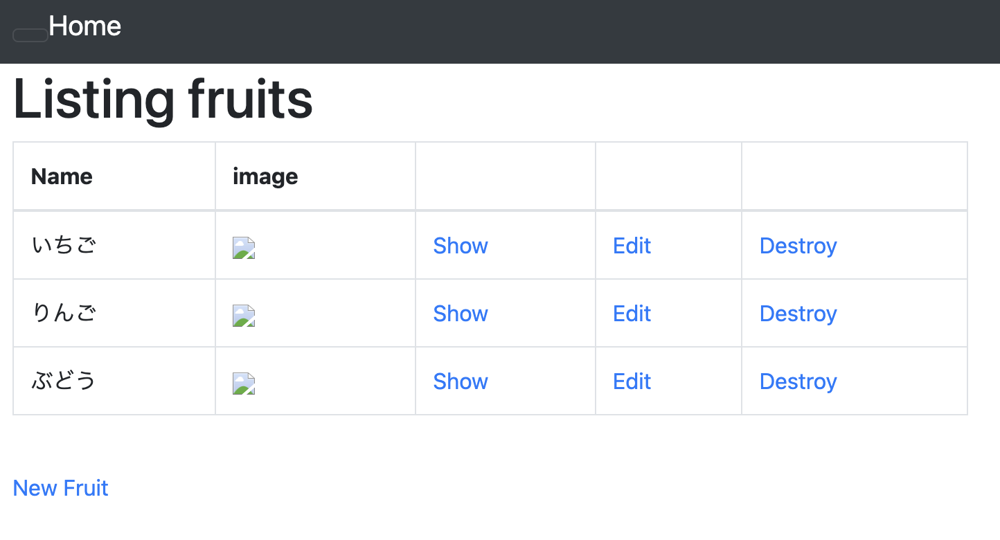
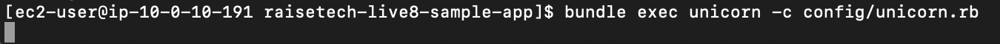
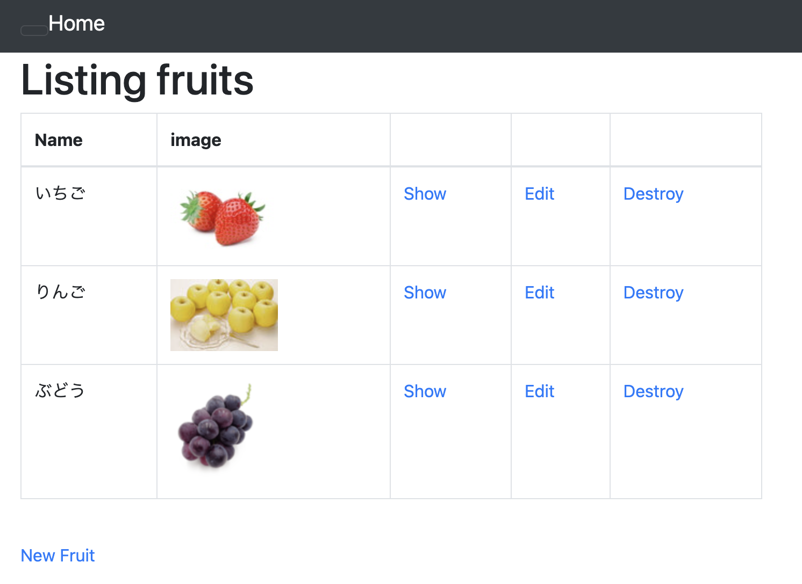

# `第５回課題`
## 課題
- EC2 上にサンプルアプリケーションをデプロイする
  - 第 3 回で使用したサンプルアプリケーションを使う
  - Nginx-Unicornで動作させる
- ALBを追加する
- S3を追加する
<br/>

## 全体の流れ
1. unicorn.rbの編集(ソケットの作成)  
1. Nginxの設定(ソケットを参照)  
1. Nginxのリロード(設定の反映)
<br/>
<br/>

## Unicornの設定
Unicornのインストールをしたり、設定ファイルを1から作ったりするのかと思っていたが、UnicornはサンプルアプリのGemfileに元から記載されていたので、インストール済みだった。  
記載されていなければGemfileをvimで開いて、下記を加えた後にbundle installを実行するらしい。

> gem 'unicorn'


設定ファイルもconfigディレクトリに[unicorn.rb](file/unicorn.rb) があったため少しの変更で設定できた。  
<br/>

### unicorn.rb 
> listen '/opt/raisetech-live8-sample-app/tmp/sockets/unicorn.sock'

Pumaの時に使ったソケットをunicornでも作っているようなので、Pumaと同じディレクトリに作るようにした。  

> pid    '/opt/raisetech-live8-sample-app/tmp/pids/unicorn.pid'

pidも作るらしい。tmpの下にpidsがあったのでとりあえずそこを参照するようにした。  

### Unicornの起動と停止
Unicornは以下のコマンドで実行できる。
```sh
bundle exec unicorn -c config/unicorn.rb
```
[Control + C] で終了できる。  
  
サンプルアプリが表示できた。  
Nginx-Pumaの時にも思ったが、「Nginx-Unicornで動いています」というエビデンスがないが、どこで確認するのかわからない。  
```sh
bundle exec unicorn -c config/unicorn.rb -D
```
-Dをつけるとデーモン化する。わかりやすく言い換えると、動き続ける。  
EC2からログアウトしてもEC2を停止しなければ動いている。  

停止するときは以下を実行すると
```sh
ps ax | grep unicorn
```
このような出力があるので
>  4420 ?        Sl     0:00 unicorn master -c config/unicorn.rb -D  
 4427 ?        Sl     0:00 unicorn worker[0] -c config/unicorn.rb -D  
 4428 ?        Sl     0:00 unicorn worker[1] -c config/unicorn.rb -D  
 4429 ?        Sl     0:00 unicorn worker[2] -c config/unicorn.rb -D  
 4446 pts/1    S+     0:00 grep --color=auto unicorn

master のプロセスID(pid)をkillコマンドで実行する。
```sh
kill 4420
```

他に、unicorn.pidを参照しても停止することができる
```sh
kill -QUIT `cat /opt/raisetech-live8-sample-app/tmp/pids/unicorn.pid`
```

### Unicornに関するその他
  
rails s と違って、Unicornの起動時には何も表示されないのでunicorn.rbの最後に以下を追記してみた。

>puts '=> Booting Unicorn'  
puts 'Use Ctrl-C to stop'

  
デーモン化する時にも表示されるので、エラーが出ても関係なく表示されるのだろうが、動いてる感が出た。  

やってもいいことなのかは知らない。  
<br/>
<br/>
<br/>

## Nginxの設定
> server unix:///opt/raisetech-live8-sample-app/tmp/sockets/puma.sock fail_timeout=0;

上記の一行を下記の一行に変更したらNginx-PumaからNginx-Unicornに変わる。

> server unix:///opt/raisetech-live8-sample-app/tmp/sockets/unicorn.sock fail_timeout=0;

Nginxは変更したらリロードを行わないと反映されない。
### Nginxに関するその他
変更しなくても追記で良い。  
両方書いとけばソケットのある方を参照してくれる。  
両方起動したらどう優先するのかは不明。  

<br/>
<br/>

## ALB
ELBを追加したらこんな感じになるのかなと予想していた。  
  
実際はパブリックサブネットが必要だったため、パブリックサブネットを追加した。EC2は置いていない。  
  
<br/>
ALBをおいた当初、ALBを使っているのか、EC2に直接入っているのかわからなかったが、アドレスバーにロードバランサーのDNS 名を入れるとサンプルアプリが表示されることに気づいた。  
EC2を停止してもロードバランサーのDNS 名は変わらないため、サンプルアプリへのアクセスが楽になった。  

その時の試行錯誤の過程でセキュリティグループを変更した。  

以下のように、まとまっていたセキュリティグループをひとつずつに分けた。  
インバウンド：SSH,HTTP,HTTPS,3000  
アウトバウンド：すべて  

HTTPSと3000は必要なさそうなので削除した。  
インバウンドのHTTPとアウトバウンドのすべてをALBにつけた。  
EC2にはSSHとHTTPのインバウンドと、すべてのアウトバウンドをつけた。  

<br/>
<br/>

### セキュリティグループについて分かったこと
アウトバウンドのすべてのトラフィックを消す
- HTTPができなくなる
- インスタンスにログインできなくなる

EC2のインバウンドHTTPを消す
- ALBでHTTPを開けていてもアクセスできなくなる

~~EC2のパブリック IPv4 アドレスやパブリック IPv4 DNSでアクセスできるのが納得いかないが、消すとアクセスできなくなる。~~  
ALBを通らない、EC2のパブリック IPv4 アドレスやパブリック IPv4 DNSを使ったアクセスをブロックする方法がわかった。  

ALBに、タイプHTTPをすべて許可するセキュリティグループを付与する。
EC2は、タイプHTTPを選んで、ALBに付与したセキュリティグループをソースにしたセキュリティグループを付与する。  

これでALBを通らないアクセス方法が消えた。  

<br/>
<br/>

## 画像の表示
何気なく/opt/raisetech-live8-sample-app/log にあるdevelopment.log　を開いたら

> MiniMagick::Error (You must have ImageMagick or GraphicsMagick installed):

というエラーがあったので調べてみたら画像に関するエラーらしいことが分かった。  
ImageMagickをインストール
```sh
sudo yum install ImageMagick
```
  
画像が表示された。  

サンプルアプリに画像をアップロードしても表示されないので、ファイル形式が悪いのかなと思って.jpgと.jpegと.pngで試したり、HTTPの基礎の動画を見直しながらデベロッパーツールを使ったら文字化けしていたので日本語に対応していないのかと思って名前を変えたりしてみたりと試行錯誤してはいたけど、表示できず、S3になれば表示されるのかなと思って放置していた問題が解決できた。
<br/>
<br/>

## nvm install 17.9.1について
EC2インスタンスを停止するたびにインストールし直さなければならないのが地味に面倒だったので少し調べた。  

コンソール起動時にコマンドを実行してくれるようにした。根本の部分での解決はできていないがよしとする。  

/home/ec2-user ディレクトリにある.bash_profile の最後に
> nvm install 17.9.1

を書き加えたらログインすると勝手にコマンドを実行してくれるようになる。  
EC2を停止せずにログインをするときはすでにインストールされているが、いいのだろうか？  

ここまでやっといて、なんだが、
```sh
rails s
```
```sh
bundle exec unicorn -c config/unicorn.rb
```
どちらもyarn も node も必要としていないことが判った。  

無駄になってしまった。  

EC2インスタンス起動時に起動ができるのかもしれないと調べているときに実行してからバージョンを確認して判明した。（動いた！ 入ってない！？）驚いた。  
調べた方法はインスタンスの初回起動時（本当に最初の一回）に実行してくれるらしい。  
毎起動時のやり方もあるらしいが、目的もないのでやめた。  

とりあえず、EC2にログインすると毎回/home/ec2-user にいるのも面倒なので以下の一行を加えた。
> cd /opt/raisetech-live8-sample-app/

サーバー起動の手間が勘違いだった分も含めて格段に減った。  

もしここにexitを書き込んだらログイン後すぐにログアウトするのだろうか？  
やったら戻せなくなりそうなのでやらないが、その後の直し方を含めて気になる。  
<br/>
<br/>

## CloudWatch
S3にはnginxのアクセスlogを入れようと思う。  

EC2に CloudWatch Logsをインストールする
```sh
sudo yum update -y
```
```sh
sudo yum install -y awslogs
```
### awscli.conf の編集
```sh
sudo vim /etc/awslogs/awscli.conf
```
> region = ap-northeast-1

リージョンを書き換える。
### awslogs.confの編集
```sh
sudo vim /etc/awslogs/awslogs.conf
```
Nginxのログは/var/log/nginx に入っている。  

> [/var/log/nginx/access.log]  
datetime_format = %d/%b/%Y:%H:%M:%S %z  
file = /var/log/nginx/access.log  
buffer_duration = 5000  
log_stream_name = {instance_id}  
initial_position = start_of_file  
log_group_name = /var/log/nginx/access.log  

コピペすればいい。
フォーマットは
[日/月(英語3文字)/西暦:時:分:秒 時差]  

設定を変えたら再起動
```sh
sudo systemctl restart awslogsd
```
Amazon Linux 2 を実行している場合は、次のコマンドを使用して awslogs サービスを開始します。
```sh
sudo systemctl status awslogsd
```
<br/>
<br/>

### IAMの作成
IAMのロールから  

ロールを作成  
  
EC2を選んで次へ  
  
ポリシーを作成  
  
JSONを選択  
[ポリシー](file/ec2-policy.txt)をコピペ（マークダウンはインデント表示がうまくいかない）  
  
名前と説明を書いて  
 
ポリシーの作成  

EC2インスタンスの  
アクション > セキュリティ > IAMロールを変更  
  
作成したロールを選択する  

  
ログが転送されるようになった。  

時間表記が協定世界時(UTC)なので日本標準時(JST)に変更する  
```sh
sudo cp -p /usr/share/zoneinfo/Japan /etc/localtime
```
  
日本時間表示になった。  
<br/>
<br/>

## S3
とりあえずバケット名だけ決めてデフォルトで作成  
  

  

  

  

  

  

困ったら削除して作り直す方針でいく。  

### ポリシーの作成
バケットの作成ができたらバケットを選択して  
アクセス許可 > バケットポリシー  
  

[ポリシー](file/s3-policy.txt)をコピペ
> my-exported-logs

使用するバケット名に変更

> Region

バケットを置いたリージョンに変更

> AccountId1

アカウントIDを右上からコピペ

> arn:aws:logs:Region:AccountId1:log-group:*

CloudWatchのロググループ詳細からARNをコピペ

### CloudWatchからS3へエクスポート
  
CloudWatch > ロググループ  

ロググループを選択したら  
  

  
アクション > データを Amazon S3 にエクスポート  

  
時間を指定してエクスポート

  
エクスポートできた。
<br/>
<br/>
## 参考
【Rails】Webサーバー「Unicorn」の基本情報と実装方法：[https://autovice.jp/articles/146](https://autovice.jp/articles/146)

【解決】Original Error: You must have the ImageMagick or GraphicsMagick installed Image Failed to manipulate with MiniMagick, maybe it is an image?：[https://qiita.com/___fff_/items/5780a2145555c9522c1e](https://qiita.com/___fff_/items/5780a2145555c9522c1e)

ターミナルで起動時にようこそメッセージを表示させる：[https://taccuma.com/hello-terminal/](https://taccuma.com/hello-terminal/)

【kill】Linuxでプロセスを終了させるコマンド：[https://uxmilk.jp/50638](https://uxmilk.jp/50638)

Linuxの「シグナル」って何だろう？：[https://atmarkit.itmedia.co.jp/ait/articles/1708/04/news015_2.html](https://atmarkit.itmedia.co.jp/ait/articles/1708/04/news015_2.html)

EC2へのアクセスをALBからのみに制限する方法：[https://tomokazu-kozuma.com/how-to-restrict-access-to-ec-2-only-from-alb/](https://tomokazu-kozuma.com/how-to-restrict-access-to-ec-2-only-from-alb/)

クイックスタート: 実行中の EC2 Linux インスタンスに CloudWatch Logs エージェントをインストールして設定する：[https://docs.aws.amazon.com/ja_jp/AmazonCloudWatch/latest/logs/QuickStartEC2Instance.html](https://docs.aws.amazon.com/ja_jp/AmazonCloudWatch/latest/logs/QuickStartEC2Instance.html)

EC2 の nginx ログを CloudWatch Logs → S3 → Athena を介して分析する：[https://qiita.com/_s__o_/items/4704d90ecb65f2c752ec](https://qiita.com/_s__o_/items/4704d90ecb65f2c752ec)

AWS CloudWatch LogsエージェントでAmazon EC2上のNginxのaccess.log , error.log , php-fpm error.log , Linuxのmessages , secureログを収集する：[https://www.yamamanx.com/aws-cloudwatch-logs-ec2-nginx/](https://www.yamamanx.com/aws-cloudwatch-logs-ec2-nginx/)
AWS EC2 のタイムゾーンを変更する手順 (memo)：[https://qiita.com/glostuan/items/8dad6d9b3b5ee123e7cf](https://qiita.com/glostuan/items/8dad6d9b3b5ee123e7cf)

コンソールを使用してログデータを Amazon S3 にエクスポートする：[https://docs.aws.amazon.com/ja_jp/AmazonCloudWatch/latest/logs/S3ExportTasksConsole.html](https://docs.aws.amazon.com/ja_jp/AmazonCloudWatch/latest/logs/S3ExportTasksConsole.html)
<br/>
<br/>


<div style="text-align: center;">

[前へ](./lecture05-2.md)

</div>