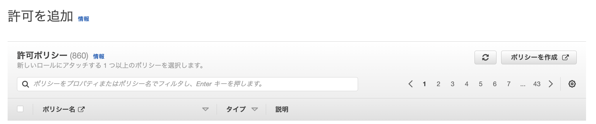

# `第５回課題（３）`
## 課題
- ALBを追加する
- S3を追加する
<br/>
<br/>
<br/>


## ALB
ELBを追加したらこんな感じになるのかなと予想していた。  
  
実際はパブリックサブネットが必要だったため、パブリックサブネットを追加した。EC2は置いていない。  
  
<br/>
ALBをおいた当初、ALBを使っているのか、EC2に直接入っているのかわからなかったが、アドレスバーにロードバランサーのDNS 名を入れるとサンプルアプリが表示されることに気づいた。  
EC2を停止してもロードバランサーのDNS 名は変わらないため、サンプルアプリへのアクセスが楽になった。  

その時の試行錯誤の過程でセキュリティグループを変更した。  

以下のように、まとまっていたセキュリティグループをひとつずつに分けた。  
インバウンド：SSH,HTTP,HTTPS,3000  
アウトバウンド：すべて  

HTTPSと3000は必要なさそうなので削除した。  
インバウンドのHTTPとアウトバウンドのすべてをALBにつけた。  
EC2にはSSHとHTTPのインバウンドと、すべてのアウトバウンドをつけた。  

<br/>
<br/>

### セキュリティグループについて分かったこと
アウトバウンドのすべてのトラフィックを消す
- HTTPができなくなる
- インスタンスにログインできなくなる

EC2のインバウンドHTTPを消す
- ALBでHTTPを開けていてもアクセスできなくなる

~~EC2のパブリック IPv4 アドレスやパブリック IPv4 DNSでアクセスできるのが納得いかないが、消すとアクセスできなくなる。~~  
ALBを通らない、EC2のパブリック IPv4 アドレスやパブリック IPv4 DNSを使ったアクセスをブロックする方法がわかった。  

ALBに、タイプHTTPをすべて許可するセキュリティグループを付与する。
EC2は、タイプHTTPを選んで、ALBに付与したセキュリティグループをソースにしたセキュリティグループを付与する。  

これでALBを通らないアクセス方法が消えた。  

ALBとEC2に3000を許可して、ソースには0.0.0.0/0を設定すると80の

<br/>
<br/>

## 画像の表示
何気なく/opt/raisetech-live8-sample-app/log にあるdevelopment.log　を開いたら

> MiniMagick::Error (You must have ImageMagick or GraphicsMagick installed):

というエラーがあったので調べてみたら画像に関するエラーらしいことが分かった。  
ImageMagickをインストール
```sh
sudo yum install ImageMagick
```
  
画像が表示された。  

サンプルアプリに画像をアップロードしても表示されないので、ファイル形式が悪いのかなと思って.jpgと.jpegと.pngで試したり、HTTPの基礎の動画を見直しながらデベロッパーツールを使ったら文字化けしていたので日本語に対応していないのかと思って名前を変えたりしてみたりと試行錯誤してはいたけど、表示できず、S3になれば表示されるのかなと思って放置していた問題が解決できた。
<br/>
<br/>

## nvm install 17.9.1について
EC2インスタンスを停止するたびにインストールし直さなければならないのが地味に面倒だったので少し調べた。  

コンソール起動時にコマンドを実行してくれるようにした。根本の部分での解決はできていないがよしとする。  

/home/ec2-user ディレクトリにある.bash_profile の最後に
> nvm install 17.9.1

を書き加えたらログインすると勝手にコマンドを実行してくれるようになる。  
EC2を停止せずにログインをするときはすでにインストールされているが、いいのだろうか？  

ここまでやっといて、なんだが、
```sh
rails s
```
```sh
bundle exec unicorn -c config/unicorn.rb
```
どちらもyarn も node も必要としていないことが判った。  

無駄になってしまった。  

EC2インスタンス起動時に起動ができるのかもしれないと調べているときに実行してからバージョンを確認して判明した。（動いた！ 入ってない！？）驚いた。  
調べた方法はインスタンスの初回起動時（本当に最初の一回）に実行してくれるらしい。  
毎起動時のやり方もあるらしいが、目的もないのでやめた。  

とりあえず、EC2にログインすると毎回/home/ec2-user にいるのも面倒なので以下の一行を加えた。
> cd /opt/raisetech-live8-sample-app/

サーバー起動の手間が勘違いだった分も含めて格段に減った。  

もしここにexitを書き込んだらログイン後すぐにログアウトするのだろうか？  
やったら戻せなくなりそうなのでやらないが、その後の直し方を含めて気になる。  
<br/>
<br/>

## CloudWatch
S3にはnginxのアクセスlogを入れようと思う。  

EC2に CloudWatch Logsをインストールする
```sh
sudo yum update -y
```
```sh
sudo yum install -y awslogs
```
### awscli.conf の編集
```sh
sudo vim /etc/awslogs/awscli.conf
```
> region = ap-northeast-1

リージョンを書き換える。
### awslogs.confの編集
```sh
sudo vim /etc/awslogs/awslogs.conf
```
Nginxのログは/var/log/nginx に入っている。  

> [/var/log/nginx/access.log]  
datetime_format = %d/%b/%Y:%H:%M:%S %z  
file = /var/log/nginx/access.log  
buffer_duration = 5000  
log_stream_name = {instance_id}  
initial_position = start_of_file  
log_group_name = /var/log/nginx/access.log  

コピペすればいい。
フォーマットは
[日/月(英語3文字)/西暦:時:分:秒 時差]  

設定を変えたら再起動
```sh
sudo systemctl restart awslogsd
```
Amazon Linux 2 を実行している場合は、次のコマンドを使用して awslogs サービスを開始します。
```sh
sudo systemctl status awslogsd
```
<br/>
<br/>

### IAMの作成
IAMのロールから  
  
ロールを作成  
  
EC2を選んで次へ  
  
ポリシーを作成  
  
JSONを選択  
[ポリシー](file/ec2-policy.txt)をコピペ（マークダウンはインデント表示がうまくいかない）  
  
名前と説明を書いて  
 
ポリシーの作成  

EC2インスタンスの  
アクション > セキュリティ > IAMロールを変更  
  
作成したロールを選択する  

  
ログが転送されるようになった。  

時間表記が協定世界時(UTC)なので日本標準時(JST)に変更する  
```sh
sudo cp -p /usr/share/zoneinfo/Japan /etc/localtime
```
  
日本時間表示になった。  
<br/>
<br/>

## S3
とりあえずバケット名だけ決めてデフォルトで作成  
  

  

  

  

  

  

困ったら削除して作り直す方針でいく。  

### ポリシーの作成
バケットの作成ができたらバケットを選択して  
アクセス許可 > バケットポリシー  
  

[ポリシー](file/s3-policy.txt)をコピペ
> my-exported-logs

使用するバケット名に変更

> Region

バケットを置いたリージョンに変更

> AccountId1

アカウントIDを右上からコピペ

> arn:aws:logs:Region:AccountId1:log-group:*

CloudWatchのロググループ詳細からARNをコピペ

### CloudWatchからS3へエクスポート
  
CloudWatch > ロググループ  

ロググループを選択したら  
  

  
アクション > データを Amazon S3 にエクスポート  

  
時間を指定してエクスポート

  
エクスポートできた。  
時間指定がUTCなので注意  
<br/>
<br/>

## CloudWatchからS3へのエクスポートをAmazon EventBridgeを使って自動化する（未実装）
結論、実装できなかった。  
毎日決まった時間にCloudWatchからS3へのエクスポートすることはできたが、事前に決めた範囲のアクセスログしかエクスポートできない。  
決められた範囲というのは範囲が**更新されない**という意味で、つまり次の日もその次の日も**全く同じ範囲**のログが吐き出される。  
これを自動化するにはLambdaが必要なので、とりあえず諦める。  

やったことを書いておく  
ロールの作成。ここでようやく理解できた気がする。  
  
カスタム信頼ポリシーを選択する。  
[エンティティ](file/Scheduler-Execution-Role.json.txt)をコピペする  
スケジューラがこのロールを使えるようになる。  
  
ポリシーは、CloudWatchlogsのフルアクセスとS3の特定バケットへの読み書き権限を許可した。  

  
スケジュルの作成  
  
スケジュール名を決める  
  
毎日なので定期的なスケジュールを選択  
cron 式は * を入れると指定なしになる  
画像では毎日06:00を指定している。  
画像のとき、分も * にすれば６時から毎分になる。  
エクスポートできるか確認するのに便利。  
5分ごととかは多分できない。5にしたら毎日06:05になる。  
  
タイムゾーンは東京。選べるのはありがたい。  
  
すべてのAPIを選択してlogsで検索。  
  
CreateExportTask を選択する。  
  
"Destination":バケット名  
"From":データの範囲(開始)  
"LogGroupName":ロググループの名前  
"To":データの範囲(終了)  
"From"と"To"はエポックタイムスタンプが入る。ミリ秒なことに注意。  
手動で変えるにしてもエポックタイムスタンプなので人間にとって分かりずらすぎる。ここを毎日変えるくらいなら手動でCloudWatchからS3へエクスポートする方が楽。  
  
デフォルト  
  
作成したロールを選択して次へ  
  
スケジュールを作成  

毎日指定した時間に7月2日〜7月3日までのログを吐き出すスケジュールが完成した。  
スケジュールをトリガーにしたルールによってターゲットのペイロードを変更するにはSDKが必要。  
<br/>
<br/>

## アップロードされた画像をS3に保存
railsアプリがアクティブストレージを使えるように準備するコマンドらしい。
```sh
bin/rails active_storage:install

bin/rails db:migrate
```
2つとも実行した。  
db/migrateディレクトリに active_storage_blobs と active_storage_attachments が生成されるらしいが、違う名前のファイルがあった。  
どこかで設定されている（？）  
生成される前にdb/migrateディレクトリを確認しておくべきだった。  
rails5くらいではバリテーションがなかったようだけど、rails7ではあるよう。  

### Gemfileの編集
Gemfileに以下の一行を加える。
> gem 'mini_magick', '~> 4.8'
```sh
bundle install
```

### storage.ymlの編集
[storage.yml](file/storage.yml.txt)を編集する  
region: と bucket: にリージョンとバケット名を書く。  
ダブルクォーテーションで囲む必要はない。  

### development.rbの編集
config/environments/development.rbを編集する  
> config.active_storage.service = :local
:local の部分を :amazonに変更する。  

### EC2にロールを追加
EC2のロールにS3のポリシーがない時のエラー  
  
EC2にS3アクセス権を追加する必要がある  
とりあえずフルアクセスの追加をした。  

１つ追加すると３つのオブジェクトがアップロードされた。  
  

追加できた。  

元から上がっていた（RDSを使っていた時にアップロードした）データに画像をEditでアップロードしてから、S3のオブジェクトを削除したら画像が表示されなくなった。  
新しく保存するものについては勝手にRDSからS3に変わったと思われるが、既存のものも問題なく表示されているので、RDSも使われている。  
EC2のロールからS3のポリシーを削除したら画像のアップロードができないので、ただ画像の保存する場所が変更された。  

<br/>
<br/>

### 3つのファイルについて
それぞれを大中小と呼ぶとき  

「大」は元データ。この画像から、アイコンと用の画像データが作成される。基本的にshowで使用されている。  

「中」はクリエイトした直後に表示されている画像データ。このページから移動しないまま「中」を削除するとshowが使えなくなる。このページで「大」を削除するとshowで使用されるようになる。  

「小」はアイコン。Homeにアクセスした時に初めて作成される。つまりHomeに来る前に「大」が削除されると作成されない。  

純粋に大中小でそれぞれ元データ、showデータ、アイコンなのかと思ったら意外と複雑で時間を無駄にした。もしかしたらEditを経由したりすると挙動が変わるかも？  
流石にどうでもいい。  

１つの画像ファイルに対し、ランダムな名前のオブジェクトを３つも作られたら管理が大変だと思い
lecture04/images/hoge/20230707.jpg  
のようにできないかと調べた。  
ついでに
lecture04/logs/nginx/20230707.txt  
のようにできないかも調べた。

これもSDKが必要。  

## 完成したlecture04の構成図
  
lecture05の課題なのにlecture04の続きで作ったからlecture04になってしまった。  

RDSのようなものが出てきたら空のサブネットを参照しようと思っていて、ALBが出てきた時に来た！と思ったのにパブリックサブネットでないといけないからAZ-cへパブリックサブネットを加えた。 
それならと、AZ-dのプライベートサブネットを消して、AZ-Cに新規に作成した。  

<br/>
<br/>

## 参考
【解決】Original Error: You must have the ImageMagick or GraphicsMagick installed Image Failed to manipulate with MiniMagick, maybe it is an image?：[https://qiita.com/___fff_/items/5780a2145555c9522c1e](https://qiita.com/___fff_/items/5780a2145555c9522c1e)

EC2へのアクセスをALBからのみに制限する方法：[https://tomokazu-kozuma.com/how-to-restrict-access-to-ec-2-only-from-alb/](https://tomokazu-kozuma.com/how-to-restrict-access-to-ec-2-only-from-alb/)

クイックスタート: 実行中の EC2 Linux インスタンスに CloudWatch Logs エージェントをインストールして設定する：[https://docs.aws.amazon.com/ja_jp/AmazonCloudWatch/latest/logs/QuickStartEC2Instance.html](https://docs.aws.amazon.com/ja_jp/AmazonCloudWatch/latest/logs/QuickStartEC2Instance.html)

EC2 の nginx ログを CloudWatch Logs → S3 → Athena を介して分析する：[https://qiita.com/_s__o_/items/4704d90ecb65f2c752ec](https://qiita.com/_s__o_/items/4704d90ecb65f2c752ec)

AWS CloudWatch LogsエージェントでAmazon EC2上のNginxのaccess.log , error.log , php-fpm error.log , Linuxのmessages , secureログを収集する：[https://www.yamamanx.com/aws-cloudwatch-logs-ec2-nginx/](https://www.yamamanx.com/aws-cloudwatch-logs-ec2-nginx/)

AWS EC2 のタイムゾーンを変更する手順 (memo)：[https://qiita.com/glostuan/items/8dad6d9b3b5ee123e7cf](https://qiita.com/glostuan/items/8dad6d9b3b5ee123e7cf)

コンソールを使用してログデータを Amazon S3 にエクスポートする：[https://docs.aws.amazon.com/ja_jp/AmazonCloudWatch/latest/logs/S3ExportTasksConsole.html](https://docs.aws.amazon.com/ja_jp/AmazonCloudWatch/latest/logs/S3ExportTasksConsole.html)
<br/>
<br/>


<div style="text-align: center;">

[前へ](./lecture05-2.md)

</div>