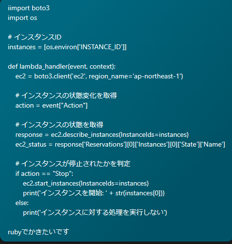
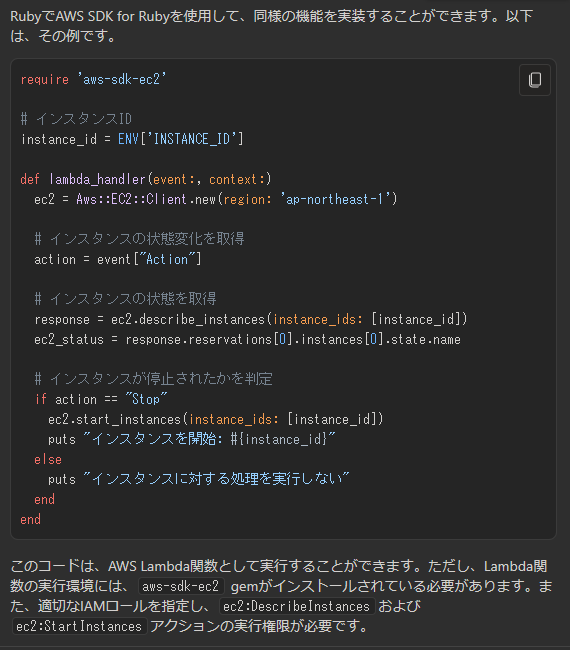
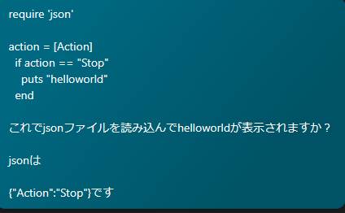
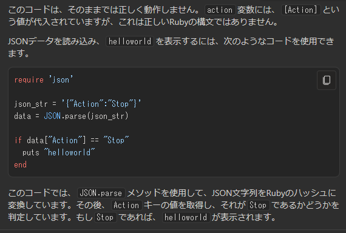
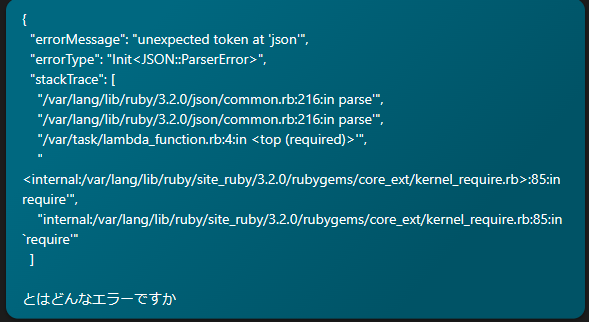
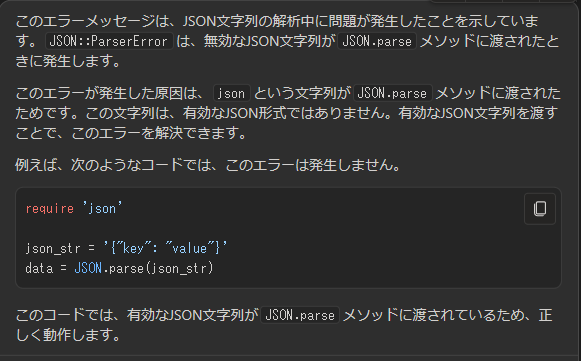
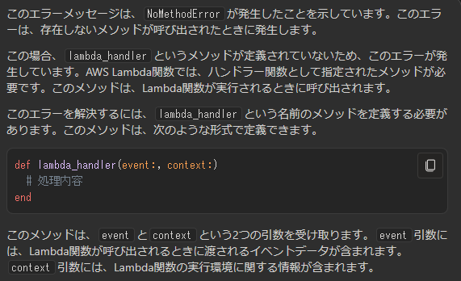
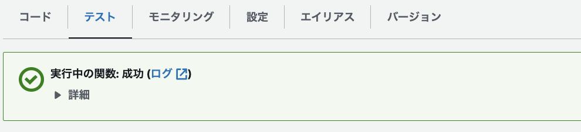

# `第５回課題（extra）`
## 課題
SDKを触ってみる。
 
 
 

## はじめに
AWS Lambdaに触れてみようかなと思っていたらちょうど[参考](https://www.aws-room.com/entry/eventbridge-ec2-start)にできそうなものを見つけたのでMicrosoft Bingを使いながら触ってみた。  
違う言語を使う時にはEC2に何かインストールしないといけないかもと思ったので、サンプルアプリと同じrubyでプログラミングした。  
 
 

## ロール
AWS LambdaにRDSのフル権限を付与している。  
もっと絞っていいとは思う。  
 
 

## やってみた
とりあえず、rubyにしてもらった。   
  
返ってきた
  
必要なさそうなところを削っていく。  
渡されるjsonもシンプルにする。  
  
返ってきたので実行してみる。  
  
エラーをそのままコピペして聞く。  
  
返ってきた通りに直して実行  
  
コピペ  
  
直す  
  
エラーがなくなった。
  
こんな感じで聞いて行ってEC2を停止した時にRDSを停止するRambdaができた。  
! extra-[end](images/extra/end.png)  
 
 

## Gemfileの編集
とりあえずサンプルアプリのGemfileに追記した。(必要ないかも？)
 
 

## ルール
[参考](https://www.aws-room.com/entry/eventbridge-ec2-start)の通りにやる。  
EC2が停止した時がトリガーだから全く同じ  
ターゲットもAWS Lambdaなので同じ  

RDSはあくまでAWS Lambdaが操作することに留意  

イベントバスにつていは謎。  
有効化にしないとダメかと思ったけど、無効にしても停止した。  

コードは間違っていてもデプロイできる。  
ロールは最初に設定しておかないとAWS Lambdaのテスト中にエラーが出る。  
RDS(Lambdaが操作するもの)も動いていないとエラーが出る。  
 
 

## 感想まとめ
EC2を勝手に立ち上げてくれてもしょうがないので、RDSを停止してくれるようにした。  
最初は自分で作るんだと意気込んでいたが、数行のコードなら簡単に作ってくれた。  
バケット操作や、スケジュールのルール変更はまたそのうちやろうと思う。  
 
 

## 参考
EventBridge を使用して EC2 インスタンスの停止を検知し再起動させる：[https://www.aws-room.com/entry/eventbridge-ec2-start](https://www.aws-room.com/entry/eventbridge-ec2-start)

