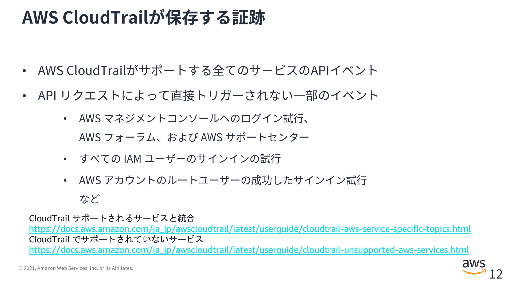

# `第６回課題`
## 課題
- 最後にAWSを利用した日の記録をCloudTrailのイベントから探し出す
  - 自分のIAMユーザー名のあるもの
  - 見つけたイベントの中からイベント名と、含まれている内容を３つピックアップする
- CloudWatch アラームを使って、ALBのアラームを設定して、メール通知する
  - メールにはAmazon SNSを使う（OKアクションも使う）
  - アラームとアクションを設定した状態で、Railsアプリケーションが使える、使えない状態にして、動作を確認する
- AWS利用料の見積もりを作成する
  - 作成したリソースの内容を見積もる
  - できたものをURLで共有
- マネジメントコンソールから現在の利用料を確認する
  - 先月の請求情報から、EC2の料金がいくらか確認する
  - 無料利用枠に収まっているか確認する
 
 
 

## 最後にAWSを利用した日の記録をCloudTrailのイベントから探し出す
### 自分のIAMユーザー名のあるもの
  
自分のIAMユーザー名(IAMRaiseTechUser)のあるイベントを見つけた。  
EC2を停止したら出てきた。  

その上のEC2stopedAlsoRDSはRambdaがRDSを止めてくれているイベント。ちゃんと動いてくれてて嬉しい。  
 
 

### 見つけたイベントの中からイベント名と、含まれている内容を３つピックアップする
  

イベント名：StopInstances  
イベント時間：July 09, 2023, 22：53：52 (UTC+09:00)  
ユーザー名：IAMRaiseTechUser  
イベント名：StopInstances  
イベントソース：ec2.amazonaws.com  

他にも、AWS アクセスキー、発信元 IP アドレス、イベント ID、リクエスト ID、などがある
エラーコードの項目もあるので（エラーは出ていないので　-　になっている）エラーが出た時に見にくればどんなことが起きたのかわかるかもしれない。  

参照されたリソースには、リソースタイプ、リソース名、AWS Config のリソースのタイムラインがある。  
リソースタイプは多分、どのサービスに対して行なったか   
リソース名はEC2ならインスタンス IDのこと  
AWS Config のリソースのタイムラインはAWS Config リソースの記録を有効化 となっている。有効化にしていない。  

イベントレコードはJSON形式のファイル   
どんな誰が："type": "accountId":  
どんな権限で："sessionIssuer":   
対象はなんで： "responseElements":   
何をしたのか："eventSource": "eventName":   

みたいなことが書かれている    

 
 

## CloudWatch アラームを使って、ALBのアラームを設定して、メール通知する
  
アラームの作成  

  
メトリクスの選択  

  
ApplicationELB  

  
AppELB 別、AZ別、TG 別メトリクス  

  
統計を最小へ変更  
期間を１分に変更(スライド通りなら5分)  

  
条件を設定する  

  
アラーム状態トリガーを選択  
新しいトピックの作成  
通知の追加を押すと  
OK -> ALARM  
ALARM -> OK  
変わった時にメールを出すようにできる  

  
次へ  

  
アラーム名と本文が書ける  
通知を追加していても１つしか書くことができない  

  
アラームの作成  

  
確認メールが届くので、リンクをクリックして認証する  
迷惑メールフォルダに入っていた  

  
作成したばかりだとデータ不足と表示されている。  
データが集まればOKに変わる  

### 届いたメール
メール本文を変えたかったのでアラームを２つ作成した  
サンプルアプリにアクセスできない状態の時（Unicornを停止した時）に届くメール  
  

サンプルアプリにアクセスできる状態の時（Unicornを開始した時）に届くメール  
  

> OK -> ALARM  
> ALARM -> OK  
自分で作った本文以外の情報も書かれることが判明したので一つにまとめた。
  

理論的には両方が同じ状態にならないが、実際は情報の更新される時間が共通でないため、片方が変わっても、もう片方が切り替わらない時間が存在する。  
  
  
その他、実際にUnicornを起動または停止した時間から、アラームが届く時間までにかかる時間は、設定した1分ではない（3〜4分ほどかかる）ことに注意する  

### その他
設定で東京をデフォルトに指定しているのになぜかリージョンが変わる現象がある。  
アラームの設定はリージョンごとに作成されるらしい。  
違うリージョンに切り替わっていることに気づかないで設定が消えてしまったのかと思った。今回は東京に作れていたので良かったが、作成する前にはリージョンの確認が必要だと感じた。  

全てのメトリクスから作成したメトリクスの状態の推移を確認することができる  
  
時間範囲の設定ができるが、UTCになっているのでLocal time zoneに変更した方が使いやすい  
  

 
 

## AWS利用料の見積もりを作成する
### 作成したリソースの内容を見積もる

#### EC2
ロケーションタイプを選択：リージョン  

リージョンを選択：アジアパシフィック（東京）  

テナンシー：デフォルトでは、インスタンスはハードウェア専有インスタンスではなく、共有ハードウェアで実行されているオンデマンドインスタンスです  

オペレーティングシステム：Linux  

ワークロード：一定の使用量  
一定の使用量  
このワークロードは、一定の予測可能な負荷を持つユースケースに適しています。これには、ウェブサイトへのトラフィックのログ記録やバックグラウンドでのプロセスの実行などのユースケースが含まれます。  
毎日のスパイクトラフィック  
このワークロードは、1 日に 1 回ピークを迎える使用パターンに最適です。例えば、午前 0 時に複数のジョブを実行する必要があるシナリオや、朝のニュースによる急増があるシナリオに適しています。  
毎週のスパイクトラフィック  
このワークロードは、週に 1 回ピークを迎えるパターンに最適です。週に 1 回投稿するブログや、週に 1 回放映されるテレビ番組などのシナリオに適しています。  
毎月のスパイクトラフィック  
このワークロードは、毎月の請求書、給与、その他の月次レポートなど、月に 1 回急増するトラフィックに最適です。  

インスタンスタイプ：t2.micro  

#### RDS
MySQL インスタンスの仕様：db.t3.micro  
使用状況 (オンデマンドのみ)：EC2の設定によって変わる？  
デプロイオプション：Single-AZ  
価格モデル：OnDemand  
Reservedはリザーブドと読み、１から3年の期間でDBインスタンスを予約できる。  
まとまった期間の運用をするなら割引されるのでOnDemandより安くなるかも。  

各 RDS インスタンスのストレージ：汎用SSD（bp2）  
ルトレージ量：20GB  

#### S3
一月当たり10GB  

#### ELB（ALB）
処理されたバイト (EC2 インスタンスおよび IP アドレスのターゲットとして)一月当たり10GB  

サンプルアプリを複数人で扱うとは考えづらいので個人用のアプリであると思われる。  
一月に10GBも使うことはないと予想されるが、0.08USDくらいしか変わらないのでとりあえず10GBに設定した。  

### できたものをURLで共有

上記（EC2、RDS、S3、ALB）の設定で作成された[サンプルアプリの見積](https://calculator.aws/#/estimate?sc_channel=cfm-blog&sc_campaign=la-get-cost-estimates-faster-with-aws-pricing-calculator-bulk-import&sc_medium=plan-and-evaluate&sc_content=cfm-blog&sc_detail=link&sc_outcome=ad&sc_publisher=cfm-adoption&trk=la-get-cost-estimates-faster-with-aws-pricing-calculator-bulk-import_cfm-blog_link&id=b21db2e8477525e46f672415255b9b938ca4c8bf)  

1年間で896.40 USD 日本円で 123,934.47 円（1 USD = 138.27 円）  
AWS ウェブサイトの価格表示は税抜価格らしいので年間約136,327.917円ほどになると予想される  

高すぎな気がする  
 
 

## 先月の請求情報から、EC2の料金がいくらか確認する
EC2は0.000032$ほどかかっているらしい。  
  

## 無料利用枠に収まっているか確認する
  
３日くらい前にS3が無料利用枠を超過した  
CloudTrailの管理イベントとデータイベントとInsights イベントを全て取ったらオーバーした  
他にも課題５でNginxのログを取ろうとしていた（毎日定時に2から3日のログをエクスポートするイベント。停止済み）ことや、画像ファイルが３つある理由を調べるために何回も画像をアップロードしたためだと思われる  

 
 
 
 
 
 
 
 
 
 
 
 
 
 
 

ここより下は動画【AWS Black Belt Online Seminar】AWS CloudTrailの内容を一部抜き出したもの  
(ほぼそのまま)  

[動画]【AWS Black Belt Online Seminar】AWS CloudTrail：[https://youtube.com/watch?v=_mmZa1Blxc4&feature=share](https://youtube.com/watch?v=_mmZa1Blxc4&feature=share)  

【PDF]【AWS Black Belt Online Seminar】AWS CloudTrail：[https://pages.awscloud.com/rs/112-TZM-766/images/20210119_AWSBlackbelt_CloudTrail.pdf](https://pages.awscloud.com/rs/112-TZM-766/images/20210119_AWSBlackbelt_CloudTrail.pdf)
 
 
 
 
 

## はじめに 
AAWS CloudTrailはWSアカウントのガバナンス、コンプライアンス、運用監査、リスク監査を行うためのサービス。

AWS CloudTrailを使用すると、AWSインフラストラクチャ全体でアカウントのアクティビティをログに記録し、継続的にモニタリングし、保持できる。  

保持したはいいが、アプリケーションからAPIをキックしてエラーになったのに原因を調べられなくて困っている。
誰が、どのアプリケーションが、なんのIAMロールを使ったのかうまく追跡できない。  
と言ったことになりがち  

AWS CloudTrail自体はログを保存するだけのサービス。これを活用するためには他のサービスも知る必要がある  

以下をオールオアナッシングではなくできることから始めよう  
- 全てのAWSリージョンでAWS CloudTrailの証跡を有効化してS3に保存する
- Amazon GradDuty
  - 有効にするだけで自動的に脅威を検知してくれる。
- AWS CloudTrail活用のベストプラクティスを取り入れる
- 調査モニタリング脅威検出

 
 

## AWS CloudTrailの基本
  
AWSは全てのサービスをAPIを通じて提供している。  
ユーザーが利用する際には、マネジメントコンソール・CLI・SDKといったものがあるが、これらはフロントエンドに過ぎず、実際には裏でAWSのエンドポイントに対してAPIのリクエストを送られている。  

  
APIのリクエストは世界中からインターネットを通じて安全に利用できるような仕組みが出来上がっている。  
認証認可と証跡の取得について取り上げる。  

誰がそのリクエストを送ってきているのか？　アクションを許可して良いのか？　これらをコントロールしているのはIAMです。  
そしてそれらの操作に対して、ログや証跡を保存することが必要で、これを担うのがAWS CloudTrail  

AWS CloudTrailはリージョンごとのサービスなので、証跡の保存はリージョンごとに設定が必要（一括で有効化するオプションがある。）  
標準で全てのリージョンが有効化されているUIもあるが、そうでないものもある。  
例えばCLIやSDKを利用する際にはユーザーが意識する必要がある。  

AWS CloudTrailが保存する証跡
  
まず、AWS CloudTrailがサポートする全てのサービスのAPIイベント。  
CloudTrailはほとんどのサービスでAPIイベントの記録をサポートしているが、一部そうでないものもある。  
理由の一つとして、サービスの特性によって保存が望ましくないものについては保存しない。  

CloudTrail サポートされるサービスと統合  
[https://docs.aws.amazon.com/ja_ip/awscloudtrail/latest/userquide/cloudtrail-aws-service-specific-topics.html](https://docs.aws.amazon.com/ja_ip/awscloudtrail/latest/userquide/cloudtrail-aws-service-specific-topics.html)
CloudTrail でサポートされていないサービス  
[https://docs.aws.amazon.com/ja_jp/awscloudtrail/latest/userquide/cloudtrail-unsupported-aws-services.html](https://docs.aws.amazon.com/ja_jp/awscloudtrail/latest/userquide/cloudtrail-unsupported-aws-services.html)

APIリクエストによって直接トリガーされない一部のイベントも保存する  
例えば、AWSマネジメントコンソールへのログイン試行がある。  
これはAPIではなくフロントエンドにあるマネジメントコンソールで完結する機能だが、重要なアクティビティなので保存している。  

CloudTrailの証跡ログはニアリアルタイムで出力される。  
1時間に複数回、およそ５分ごとに発行される。各アカウントのアクティビティはそのアクティビティの発生から通常１５分以内に配信される。  
デフォルトで、ログファイルは永続的に保存される。
インサイトイベントという特殊なイベントは異常なアクティビティから通常30分以内にバケットに配信される仕組みになっている  
 
 

## 証跡ログの保存、保護
  
証跡の作成というメニューから証跡の作成が行える  
新規のバケットを作成すると
ログは bucketname/AWSLogs/アカウント ID に保存される  
組織内のすべてのアカウントについて有効化にチェックを入れると  
ログは bucketname/AWSLogs/組織 ID/アカウント ID に保存される  

AWS CloudTrailには証跡のログが3つある  
  
インサイトエベントは管理イベント、データイベントとは少し毛色の違うものになる
管理イベントの中で、読み取り専用でないもの  
具体的には、何かを変更するようなイベントを監視して、異常な傾向があればそれを報告するイベント  
機械学習を利用して、パターンを学習し、そのパターンから外れたイベントを出力する。  

  
AWS CloudTrailはS3の他にもAWS ClowdWatch Logsへの出力もサポートしている

ログを無期限に保存し続けるということは基本的にせず、ある一定期間が経ったらS3へ、さらにS3に比べてよりリーズナブルなAmazon Glacierへと、このようにある程度の期間を定めて保存する場所を変え、場合によっては最終的に削除する。  
ことをライフサイクルという。  
Glacierはグレイシャーと読み、S3のストレージクラスの一つ。迅速取り出しを行うと1から５分でアクセスできる。最大5から１２時間で一括取りを無償でリクエストすることもできる。  

ClowdWatch Logsはコストが高めに設定されているので、ClowdWatch Logsへの保存は短めに設定されることが多い。  
こう言ったことを考慮しながらライフサイクルポリシーを作成していく。  

  
ログについて、集約も考えると良い。  
複数のリージョンや、複数のアカウントで運用していると、そのリージョンごと、アカウントごとに管理・運用をするので、煩雑になりやすい。  
一つのアカウントにログを集約してきた方が管理運用がやりやすい。  

そのログの統合、集約という機能はAWS Organizationsという仕組みを使うことで簡単に行える  
  
AWS Organizationsはマルチアカウントの統制を容易にするための仕組み  
Organizationsの画面でCloudTrailの統合の設定を行う
統合の設定が終わったらCloudTrailのメニューから組織内のすべてのアカウントについて有効化というテェックボックスを有効にして証跡作成の設定を行うと、Organizationsで構成されているメンバーアカウント、管理対象のアカウントに対して自動的に、クロスアカウントでCloudTrailに集約されて、ログの出力を特定のログアーカイブアカウントに指定することができる。

ログは保存する際に保護を考える必要がある  
  
業界レギュレーション、ガイドライン、場合によっては組織固有のポリシーなどによって保護の方法が定められていることがある。  
- データの耐久性について考える
- 改ざん検知の仕組みを導入することを考える
- 読み取り専用（Write Once Read Many）のメディアで保存する
係争に発展した場合にその証跡が正しいかどうかを説明する必要がある。  
証跡それ自体を、本当か証明するときに、それが正しいと説明するのはAWSを利用して、サービスを提供している側の責任になる。  
日本国においては裁判に発展した場合も同様で、その証拠を採用に値するかどうかは裁判官や裁判所が決めることになる（自由心証主義）  
とにかく、そのログが正しいものであることを自分たちが確認できる。あるいは第三者にそのことを説明できることが重要  

そのためにどのように実現するのか？  

  
CloudTrailにはログファイルの整合性検証という機能がある  
電子署名のメカニズムによって、証跡のログがCloudTrail以外によって変更されていないことを検証可能にする。  
CloudTrailはAmazon S3のバケットに保存するのが基本になる。  
Amazon S3のバケットというのは権限さえあればその内容を削除したり、あるいは改ざんすると言ったことが可能です。  
検証にはAWS CLIが必要。マネジメントコンソールやSDKではサポートしていない。  

  
KMS（Key Management Service：鍵管理システム）の暗号化　　
データを暗号化する際にKMSという鍵管理の仕組みを使って権限を持っているユーザーにしか復号ができない仕組み
バケットに参照できる設定になっていても、鍵へのアクセス権が設定されていなければ、鍵が必要なので、第三者からの意図しない参照をアクセスコントロールに加えて、多重の意味で予防できる。

バージョニング
データを取得する際に、前のデータを見た目上は削除するが、復元できる形で保護し続ける仕組み  
ユーザーの必要に応じて、古いバージョンを取得することができる  
無限に取り続けるとコストがかさむので、一定期間保存するライフサイクルポリシーを作成する必要がある
有効にすると、削除する際にMFA認証（多要素認証）を要求するようにできる。  

MFA Delete  
誤って削除することをなくす特権のあるユーザーしか削除できないという仕組み  

Write Once Read Many(WORM)モデル  
S3にはオブジェクトロック、Glacierにはボールドロックがある。  
設定した期間内は（AWSアカウントの削除以外には）何をやってもデータの削除することができない。  
アカウント削除によるデータの削除のことはデータの破棄と書いて区別することが可能。（だと思われる）  
ライフサイクルポリシーを作成したい場合は期間ごとにAWSアカウントを分けて保存する必要が出てくる。  

レプリケーション  
Amazon S3のバケット間でオブジェクトを自動で非同期的にコピーする  
S3の使用に準ずる  

AWS Config Rules  
構成管理と変更管理を行うサービスAWSのインフラストラクチャの設定を保存し、その中身をルールに基づいて自動的にチェックしてくれる仕組み。  
  
AWSが提供するマネージドルールのほか、自分で設定できるカスタムルールが存在する。  
画像は全てマネージドルール  
マネージドルールは選択して有効化するだけで利用することが可能になる。  

AWS Seclity Hub  
AWS Configのバックエンド。状態の可視化をしてくれるサービス。  
AWS Seclity Hubのセキュリティ基準もAWS Config Rulesで設定される。  
 
 

## コスト最適化
AWS CloudTrailにはコストがかかる。  
  
管理イベントの最初の配信のみ無料で、２つ目からは有料  
データイベント、インサイトイベント（管理イベント以外は）、すべての配信が有料
Amazon ClowdWatchに配信した場合、Amazon ClowdWatchの利用料が発生

すなわちAWS CloudTrailから配信する先・配信する証跡を多く設定すると同一のデータの出力であっても追加コストが発生する

イベントセレクターやデザインパターンによってコストを工夫し、最適化するとコストが抑えられる

  
イベントセレクターはデータイベントログを選択して保存するための機能  
データイベントログは運用方法によっては膨大な量になる。そのため、データの保存を限定することが必要になってくる。  

イベントセレクターではイベントの名前、対象とするオブジェクトのリソースが持つARNの取得ができる  
限定して取得することでコストのコントロールができる  

イベントセレクターは管理イベントのみに対応している。データイベント、インサイトイベントはイベントセレクターでは操作できない。  

デザインパターン  
  
AWS CloudTrailの中で証跡を複数指定して複数の箇所に用途ごと保存するアプローチがあるが、一度全部のログをS３に保存して、そこから各用途に分けてロードして行くアプローチもある。  
後者のパターンを選択すれば、重複した出力がなくなるので、AWS CloudTrailのコストについては節約することができる。と、同時に、Lambdaを使ってログの加工もできる。  
使いやすいという点でも検討に値する一般的なアプローチ  
 
 

## 証跡ログの調査
  
AWS CloudTrailの証跡ログでわかることは、いつどこで誰が何をして、どのような結果になったのか一般的な５W1Hに１R（R：Rはresult。成功したのか、失敗したのか。どういった結果を与えたのか。）が加わる  

  
AWS CloudTrailのログは構造化されたJSON形式になっている。  
各エレメント、要素として情報が含まれている。  

AWS CloudTrailのイベント履歴から参照することができる。  
過去９０日間の管理イベントを無料で参照、ダウンロード可能  
イベント履歴の機能でも簡単なフィルタリングができる。簡単なとは、単一の属性キーに対するフィルタリングのみを有する。  
つまりクエリなどを用いた高度な検索、調査機能はない。  
複数行選択することで比較することができる  
  
表示からむを追加することもできる  
  

これらはCLIやSDKでも確認できる  
  
マネジメントコンソールにはあった比較機能は有さないが、フィルタリング条件に、あらかじめ用意したJSONファイルが利用できる。  

イベント履歴のみでは十分な調査（高度な調査）は行えない。  
  
適材適所な調査ツールを選択する必要がある。  
どういった場所に保存してあるのかで使えるサービスが限定される。  

Amazon S3が、AWS CloudTrailがログを出力する際の最も基本的な場所になる。  

S3に保存されたログを調査したいというニーズがあれば、まずはAmazon Athenaを利用することが、最も基本的な仕組みになる。  
S3に保存されたログを保存されたままの状態で検索することができるサービス。  

Amazon Athenaで調査できないような高度な分析、調査を行いたいニーズがあった場合に他の選択肢が候補になってくる。  

例えば、AWS Elasticsearch Serviceサービスや、サードパーティーのサービスを検討する。  

ClowdWatch Logsに保存されていれば、Amazon CloudWatch Logs Insightsを用いてログの分析を行うことができる。  
ClowdWatch Logsにログを保存するとコストがかさむため、ここに長期保存することは一般的でないため、使い方、使える局面は限定的になる。  

S3 Glacierに保存されている場合は、一度S3に取り込む必要がある。  
S3に取り込んだなら、先の方法で分析、調査を行う。  

Amazon Athena  
  
Amazon S3内のデータをSQLで分析できるインタラクティブなクエリサービス  
従量課金で、使った分だけの請求  

ログ調査のようなスポットでのアドホックな利用に適している  

データセットを選択する  
Amazon S3のバケットを選択する。  

テーブルを選択する  
選択してもその中のデータの形式や構造はわからないため、定義する必要がある  
SQL文で定義する必要がある  

データをクエリする  

初めて利用する場合には作業ファイルの出力先として別のS3バケットの設定が必要  
S3を新規作成して指定するだけ  
Amazon Athenaの画面にナビゲーションが出てくるからそれに従う  

  
AWS CloudTrailのログ形式に合わせたテーブルの定義はテンプレートが用意されている  
証跡ログが保存されているバケットを指定して、クエリを実行すると自動でCloudTrailに適したテーブルが作成される  
次のステップからはSQL文で調査できる。  

このテーブルは独自にカスタムすることも可能  

SQL文は  Amazon Athena以外を使う場合のものもドキュメントにのっている。  

ここから少し省く  元動画を参照  

Amazon Elasticsearth service  
RESTful 分散検索/分析エンジンElasticsearchのフルマネージドサービス  
大規模かつ簡単でコスト効率の良い方法を使用してデプロイ、保護、実行することができる    
インスタンスとストレージの維持に追加コストが発生  
Kibanaによる可観測性（オブザーバビリティ） をサポートしている  
複数のログを横断的に分析することができる。相関分析がやりやすい  

Amazon CloudWatch Logs Insights  
従量課金  
ロググループと対照期間を指定し、クエリを実行する  
利用する際のクエリは独自のもの  

また元通りに書く  

  
調査をするとき、どのようなデータ、フィールドに着目すればいいのかは、目的によって異なる。  
アラートの名前を見ながらその周辺のログを見ていく  
何かアクションに失敗した場合はエラーを見ていく  
特定ユーザーや、特定の送信元IPアドレスからの操作について時系列に沿って見ていく  

  
リクエストを送ったプリンシパル（誰が行ったのか）を、その種類とともに示すもの
画像ではIAMユーザーのAliceというユーザーが扱っている  

IAMユーザーなら直接的に誰がの部分がわかるが、ロールの場合はどんなロールなのかではなく、誰がそのロールを使ったのかについて特定したい。  
追加で他の要素の参照が必要  

パターンがいくつかある  
  
簡単な方法  
"userldentity":の要素の中、"principalld":および"arn":の末尾にRoleSessionNameという値がある  
特定の条件下ではここにロールを利用したプリンシパル(誰がスイッチロールした結果、このロールを使っているのか)の情報が含まれるので確認できる。  

RoleSessionName は AssumeRola。すなわちロールを引き受ける際に指定するオプションである。  
このオプションの指定は必須なので、任意の文字列を入れることも可能だが、あらかじめ決まったものを入れる仕組みで構成されているものの場合。  

具体例  
元々のユーザーidを含めるような構成ユーザー名が入ってくるので特定ができる。例としてマネジメントコンソールを使ったスイッチロール、AWSのリソースにアタッチされたIAMロール、
インスタンスプロファイルで指定されたインスタンスが引き受けているロールについてはインスタンスidが含まれてくる  
ASMLやWeb ID フェデレーションの際は認証機能を持っている側でロールセッションネームを指定する
AWSの標準的な手順に則って設定した場合には元々のユーザーの値を含めるようになっているので元々のユーザーをt特定できる  

AssumeRolaのロールセッションネームには任意のものが設定できるが、限定することも可能  
IAM側のポリシーでSTSロールセッションネームを特定の値だけしか受け付けない。たとえばユーザー名しか受け付けないというオプションに設定しておけばRoleSessionNameのところに確実にユーザーの名前が入ってくる  

RoleSessionNameにプリンシパル名を含めてAssumeRolaするようなケースにはRoleSessionNameから元々のユーザーが誰なのか特定するここまでが、簡単な方法

その他の方法  
シンプルな方法の一つは、AssumeRolaのイベントを参照していく  
  
プリンシパルを特定したいロールが実行したイベントのの中にuserldentityの中に"principalld":やarnと言ったものがある  
この値に合致するものをAssumeRolaのイベントから探す  

AssumeRolaのレスポンスのエレメントに"assumedRoleUserというものがある  
このassumedRoleUserの中にある"assumedRoleld":の値と"principalld":が一致すると、assumedRoleldの値を指定しているので、AssumeRolaのイベントにある"userldentity":を参照すれば元々のユーザーあるいはプリンシパルを確認することができる。  

画像ではprincipalldにフォーカスをして着色されていて、これには理由がある  
  
理由ば一意の識別子であること  
IAMがユーザー、グループ、ロール、ポリシー、インスタンスプロファイルなどを作成するとき、各リソースに画像のような一意の識別子が割り当てられる  
この値を見なくても多くの場合、フレンドネームやarnの情報を用いて、それが誰かを識別することができる  
しかし、より厳密に一意に識別するための仕組み。
たとえばIAMユーザーを削除して、もう一度同じ名前で作成した場合、ユーザーの名前は一緒でも実際に操作する人は別のこともある  
そう言ったものをより厳密に区別する仕組みがAIDAやAROAから始まる一意の識別子である  

人間が扱う際はフレンドネームや、arnを使ったほうがわかりやすいが、自分たちでスクリプトを組む際や、自動化をすると言ったニーズの際には、より厳密な方が推奨される  

  
リクエストがエラーを変える場合にその詳細を出力する  
留意点として、サービスによって出力するフィールドの階層が異なってくる  
最上位のフィールドにエラーメッセージ、エラーコードがあるものもある。
それとは別にresponseElements という要素の中にエラーメッセージ、エラーコードが入っているものもある  

したがって何かしらのクエリで情報を取ってくる場合には想定していない方に情報が入っている場合もあるのでそのことを踏まえて、クエリすることを推奨している（仕様をよく確認してくれという話）  

エラーメッセージやエラーコードが存在しないイベントはリクエストに成功したということ  
 
 

## 証跡ログのモニタリング、脅威検出
  
いきなり全てを取り入れるのではなく、まずは有効化するのみで開始できるモニタリングや脅威検出のサービスを使う  
それべも足りないということがあれば独自のモニタリングや脅威検出の仕組みを構成し、メンテナンスしていくことが必要  

  
こういったモニタリングや、脅威検出に用いられるサービスが複数ある  

自動でやってくれるものとしてはAmazon GuardDuty、AWS CloudTrail Insights  
自身で独自にモニタリングや脅威検出を実現するためにはCloudWatch LogsやAmazon ElasticsearchService その他、サードパーティーのサービスがある  
メンテナンス体制が必要になってくる  

何かあったときに調査をするのではなく、何かがある前にモニタリングして、脅威を見つけたい  

Amazon GuardDuty  
  
セキュリティの観点からAWSのインフラストラクチャ上で生じている脅威を検知するサービス  
AWSのインフラストラクチャ上で取得可能なログのみをチェックする。  
CloudTrailを含めてさまざまな総合インテリジェンスに合致して、ログ分析をして、疑わしいものを見つけてくれるサービス  
AWSのインフラストラクチャ上で動くので、構成変更が不要で、値段もリーズナブル。３０日間の無料期間もある  

AWS CloudTrail Insights  
  
インサイトイベントの話。  
管理イベントを自動的に分析して、動作のベースラインを集計して作っておく  
ベースラインから離れたAPIコールがあった場合には、それを検出して報告してくれる  

画像ではRuninstancesというインスタンスを作成するイベントが通常の500%(5倍)発生している  
詳細をプルダウンすると、該当するイベントの一覧が表示され、さらにそのイベントがタイムラインでどのタイミングで起きたのかを可視化している

パターンマッチに該当しない傾向分析に基づく検知検出を自動で行うことができるサービス  

AWS CloudTrail Insights は無料期間はなく最初から有料  

SIEM on Amazon Elasticsearch Service (Amazon ES)  
  
特定のフレーズ、パターンマッチング等でモニタリングするサービス  

ユースケースとしては  
  
様々なトリガーを使ってイベントが発生したことをユーザーに通知するといった使い方になる  

  
Amazon CloudWatch Logsは非常に便利な仕組みになっている  
画像は、モニタリングする際によく見るパターンをいくつか紹介している  

たとえば普段使いしていないルートアカウントでの操作があればそれだけで異常なので"type":"Root"を指定するとか  
そのほか、CloudTrail構成変更、操作の失敗・エラー、IAM関連、インスタンス関連、ネットワーク構成変更と言ったものに対してパターンを作っておくとモニタリングができる  
これらは自分で設定やモニタリングが必要になる  

最後にぜひお勧めしたいサービスがSIEM on Amazon Elasticsearch Service(Amazon ES)  
  
Amazon Elasticsearch Serviceを拡張するためのテンプレートの機能  
AWS サービスのログの可視化やセキュリティ分析を実現する（AWSの社員が作成している）テンプレート  
GitHub上で公開されていて、クラウドフォーメーションのテンプレートを実行するとおよそ２０分間で環境が整う  

分析対象のログを指定したS3バケットにエクスポートするだけで、複数種類のAWSが提供するログについて、相関分析、作成済みのダッシュボードによる可視化が可能  
画像ではCloudTrailの証跡ログを可視化したダッシュボードの例  
ログインに失敗等のカウントや、地図に基づく、リクエスト元のマッピング、ボリュームについての分析や可視化が展開するだけで利用できる  
Elasticsearch Serviceの機能を使ってログの調査も可能  

非常に強力な仕組みなので、もし高度な脅威検知をしていきたい場合にはスタートラインを加速させるロケットスタートできる仕組み  

## 振り返り
- オールオアナッシングではなくできることから始めていく
  - すべてのAWSリージョンでAWS CloudTrailの証跡を有効化
  - Amazon Gurad Dutyの有効化（３０日間無料）
- AWS CloudTrailでのセキュリティのベストプラクティスを取り込む
- 調査、モニタリング、脅威検出の体制整備を進める

ベストプラクティスはドキュメントにまとまっている  
  
AWS CloudTrailでのセキュリティのベストプラクティス：(https://docs.aws.amazon.com/ja_jp/awscloudtrail/latest/userguide/best-practices-security.html)[https://docs.aws.amazon.com/ja_jp/awscloudtrail/latest/userguide/best-practices-security.html]

適材適所の調査手法  
S3にログを置いてまずはAmazon Athenaを使って調査しようという話  
そしてElasticsearch Serviceを使って  
(Amazon ES) でロケットスタート  
 
 

## 参考
[動画]【AWS Black Belt Online Seminar】AWS CloudTrail：[https://youtube.com/watch?v=_mmZa1Blxc4&feature=share](https://youtube.com/watch?v=_mmZa1Blxc4&feature=share)  

【PDF]【AWS Black Belt Online Seminar】AWS CloudTrail：[https://pages.awscloud.com/rs/112-TZM-766/images/20210119_AWSBlackbelt_CloudTrail.pdf](https://pages.awscloud.com/rs/112-TZM-766/images/20210119_AWSBlackbelt_CloudTrail.pdf)

