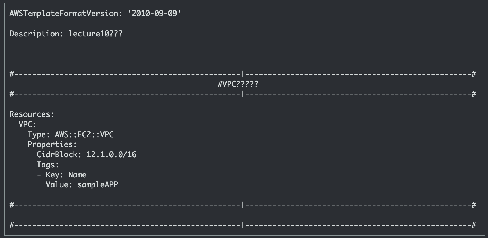

# `第１０回課題（１）`
## 課題
- CloudFormation を利用して、現在までに作った環境をコード化しましょう。
  - コード化ができたら実行してみて、環境が自動で作られることを確認してください。
- 結果を Discord で報告してください。
<br/>
<br/>

## 準備
### 調べる
録画授業は方針を示してくれるだけなので、やり方の部分をどうするか決める  

[動画]  
【AWS Black Belt Online Seminar】AWS CloudFormation：[https://youtu.be/Viyqh9fNBjw](https://youtu.be/Viyqh9fNBjw)


Visual Studio Codeでできるらしい。Visual Studio Codeはインストールしてあったので、これを使っていこうと思う。
とりあえず、便利そうなcfn-lintを入れる。

### cfn-lintのインストール
VSCodeにCloudFormation Linterをインストールする手順：[https://qiita.com/ita-k/items/31d640d708925c0ae838](https://qiita.com/ita-k/items/31d640d708925c0ae838)  

pythonのパスの設定がうまくいかなくて少し詰まった。  
pythonはもともと入っていて、RaiseTechを受講しはじめのターミナルを使いた頃、ホームディレクトリがフルネームになっていたのを変更したのが原因だった。  

```sh
pyenv uninstall 3.10.4
pyenv install 3.10.4 
```

インストールしなおしたら解消された。  

ついでに日本語にした。  
Visual Studio Codeを日本語化する：[https://www.javadrive.jp/vscode/install/index4.html](https://www.javadrive.jp/vscode/install/index4.html)

拡張機能のところにmarkdownと入力してみたらいい感じのものがあったのでそれも入れる  
githubに上げなくても編集しながら画像を映せるようになったので、便利になった。  

### 方針
lecture04と同じ流れで作成していこうと思う  
1. VPCの作成
1. サブネットの作成
1. インターネットゲートウェイの作成
1. ルートテーブルの設定
1. EC2の作成
1. RDSの作成

lecture04ではサブネットを２つしか作っていないが、４つ作成する。  
とりあえずはそこを目指す
  

## VPC
【CloudFormation入門】5分と6行で始めるAWS CloudFormationテンプレートによるインフラ構築：[https://dev.classmethod.jp/articles/cloudformation-beginner01/](https://dev.classmethod.jp/articles/cloudformation-beginner01/)  
ここを参考に作っていく。  

Descriptionやコメントに日本語は使えるが、AWSの方では?で表示されてしまうらしい。  
  
  
動作に問題はないのかもしれないが、異常はあるので使わない方針でいこうと思う。  

```yml
VPC:
  Type: AWS::EC2::VPC
  Properties:
    CidrBlock: 12.0.0.0/16
    EnableDnsHostnames: 'true'
    EnableDnsSupport: 'true'
    Tags:
    - Key: Name
      Value: sampleAPP
```
AWS::EC2::VPCプロパティを[一覧で見る](resourcelist/AWS::EC2::VPC.md)  

> EnableDnsHostnames: 'true'
> EnableDnsSupport: 'true'

どちらも[DNS 設定]の話  
DNS ホスト名を有効化  
DNS 解決を有効化  

### 使用したリソース  
[AWS::EC2::VPC](https://docs.aws.amazon.com/ja_jp/AWSCloudFormation/latest/UserGuide/aws-resource-ec2-vpc.html)  

## サブネット 
サブネットを４つ作る。 
```yml
priSubnetAZa:
    Type: AWS::EC2::Subnet
    Properties:
      AvailabilityZone: ap-northeast-1a
      CidrBlock: 12.0.10.0/24
      MapPublicIpOnLaunch: 'true'
      VpcId: !Ref VPC
      Tags:
      - Key: Name
        Value: pub-Subnet-AZa  
```

AWS::EC2::Subnetプロパティを[一覧で見る](resourcelist/AWS::EC2::Subnet.md)  

pubとはしてあるが、ゲートウェイやルートを設定していないので、現段階ではパブリックサブネットではない。  

４つ書いて値を変えれば、問題なく作成はできる。が、cfn-lintは怒っている。  
> [cfn-lint] W3010: Don't hardcode ap-northeast-1a for AvailabilityZones

アベイラビリティゾーンを直接指定するのは、あまりよろしくないらしい。  

関数を使うとアベイラビリティゾーンを変数で扱うことができる  
```yml
AvailabilityZone: !Select 
  - 0
  - !GetAZs 
    Ref: 'AWS::Region'
```
いきなり飛躍した気がするので、分解する  

組み込み関数が３つと擬似パラメータ１つが使われている。  
- 組み込み関数
  - Select
  - GetAZs
  - Ref
- 擬似パラメータ
  - AWS::Region

ひとつずつ見ていく  

### [!Select](https://docs.aws.amazon.com/ja_jp/AWSCloudFormation/latest/UserGuide/intrinsic-function-reference-select.html)
インデックスによってオブジェクトのリストから 1 つのオブジェクトを返します。  
インデックスが0でオブジェクトのリストからap-northeast-1aが取り出されたということらしい。  
!Selectは短縮系の構文で、完全関数名の構文はFn::Select:になる。    

### [!GetAZs](https://docs.aws.amazon.com/ja_jp/AWSCloudFormation/latest/UserGuide/intrinsic-function-reference-getavailabilityzones.html)
指定したリージョンのアベイラビリティーゾーンをアルファベット順にリストした配列を返します。  
空の文字列を指定した場合、AWS::Region を指定したと見なされます。  
オブジェクトのリストとは配列のことらしい。
東京リージョンの場合はa、c、dがそれぞれ0、１、２に当たる。  
!GetAZsは短縮系の構文で、完全関数名の構文はFn::GetAZs:になる。  

### [Ref:](https://docs.aws.amazon.com/ja_jp/AWSCloudFormation/latest/UserGuide/intrinsic-function-reference-ref.html)
指定したパラメータまたはリソースの値を返します。  
AWS::Regionを指定して、パラメータを返してくれているということらしい。  

### [AWS::Region](https://docs.aws.amazon.com/ja_jp/AWSCloudFormation/latest/UserGuide/pseudo-parameter-reference.html)
擬似パラメータは、AWS CloudFormation によって事前定義されたパラメータです。テンプレートでは宣言しません。パラメーターと同じように、Ref 関数の引数として使用します。  
リージョンのパラメータを持っている擬似パラメータ  

なるほど？  

完全関数名の構文のみで書いた場合は次のようになる。
```yml
AvailabilityZone:
  Fn::Select: 
    - 0
    - Fn::GetAZs:  
        Ref: 'AWS::Region'
```
インデントに気をつけないと画像のようなエラーが出てくる  
  
エラーにはそもそも通してくれないものと、エラーを出しながらもやってくれるパターンがあるらしい（？）  
画像はRef:のインデントがFn::GetAZs:と揃っていたために出てきたエラー。  

エラーを出しながらもサブネットは作ってくれるので、短縮系を使わないなんて「美しくない」という意味なのかと思ったが、インデント位置がおかしいから「整形式でない」という意味だった。  

話を戻すと、やっていることは
1. Ref: に擬似パラメータを渡して、そのパラメータを返してもらう（今回はリージョン）
1. Fn::GetAZs: にリージョンを渡して、そのリージョンのAZをオブジェクトにもつリストを返してもらう(ap-northeast-1a,ap-northeast-1c,ap-northeast-1d)
1. Fn::Select: にインデックスとリストを渡して、それに該当するオブジェクトを返してもらう

このような段階を踏みながら最終的にAvailabilityZone:にap-northeast-1aが入る  

### A:BとA::Bの違いについて
A:Bは Key: Value の関係。マッピングや連想配列という。  
AvailabilityZone: ap-northeast-1a であれば、AvailabilityZoneは ap-northeast-1a という値を持っている（設定している）
A::BはCloudFormationの疑似パラメータまたはリソースタイプ(A::B::C)を表している。  
AWS::Region であれば、AWSが事前に定義した、リージョンのパラメータを持つ擬似パラメータだし（使用するにはRefが必要）、AWS::EC2::Subnetなら、Subnetリソースを表している。  

そもそもの話  
Resourcesセクションには、スタック内の各リソースが含まれている。  
各リソースに一意の論理IDを割り当て、TypeとPropertiesの2つのプロパティを指定する。  

```yml
Resources:
  一意の論理Id1:
    Type: リソースタイプ
    Properties: 指定したリソースタイプが持つプロパティの中身

  一意の論理Id2:
    Type: リソースタイプ
    Properties: 指定したリソースタイプが持つプロパティの中身
```
この形がおそらくこの課題で理解すべきもので、おそらく、AWS::EC2::Subnet やAWS::Regionのように::を含む形で表されるものは定義されたもの。つまり、理解するものではない。  
感覚的にはAWS::VPC::Subnetの方がしっくりくるが、Amazonが決めたからどうしようもない。  
最初、[公式](https://docs.aws.amazon.com/ja_jp/AWSCloudFormation/latest/UserGuide/aws-template-resource-type-ref.html)でVPCを探したけど見つからなくて、調べたらEC2の中にあってなんでだと思っていた疑問が多分解決した。  
意味はない。  
もしかしたら、過去にはEC2で選択できたのかもしれない。  

```yml
MapPublicIpOnLaunch: 'true'
```
サブネット内で起動したインスタンスが自動でIPアドレスを取得するかどうかという話。  
プライベートサブネットについては必要ないので消す。  

### 使用したリソース  
[AWS::EC2::Subnet](https://docs.aws.amazon.com/ja_jp/AWSCloudFormation/latest/UserGuide/aws-resource-ec2-subnet.html)  


## インターネットゲートウェイの作成
IGWを作成してVPCにアタッチした
```yml
InternetGateway:
  Type: AWS::EC2::InternetGateway
  Properties:
    Tags:
    - Key: Name
      Value: IGW-Internet

AttachGateway:
  Type: AWS::EC2::VPCGatewayAttachment
  Properties:
    VpcId: !Ref VPC
    InternetGatewayId: !Ref InternetGateway
```
AWS::EC2::InternetGatewayプロパティを[一覧で見る](resourcelist/AWS::EC2::InternetGateway.md)  
AWS::EC2::VPCGatewayAttachmentプロパティを[一覧で見る](resourcelist/AWS::EC2::VPCGatewayAttachment.md)  

特に書くこともない。  

強いて書くなら、!Refに一意の論理IDを渡しているのが初見かもしれない。  
そういうこともできる。  

  
ゲートウェイが作成された。  
課題４を見てみると、VPCを指定する項目がなかったのにIGWが作成できることに困惑していた。懐かしい。  
やっていたことがそのままコードになっていて面白い。  

sampleAPPVPC-IGWみたいな汎用性のない作りにセンスを感じないが、とりあえずは完成を目指すことを優先しようと思う。  
気が変わったら直す。  

### 使用したリソース  
[AWS::EC2::InternetGateway](https://docs.aws.amazon.com/ja_jp/AWSCloudFormation/latest/UserGuide/aws-resource-ec2-internetgateway.html)  
[AWS::EC2::VPCGatewayAttachment](https://docs.aws.amazon.com/ja_jp/AWSCloudFormation/latest/UserGuide/aws-resource-ec2-vpc-gateway-attachment.html)  


## ルートテーブルの作成とルートの設定
### ルートテーブルの作成
```yml
  RouteTable:
    Type: AWS::EC2::RouteTable
    DependsOn: AttachGateway
    Properties:
      VpcId: !Ref VPC
      Tags:
      - Key: Name
        Value: pub-IGW
```
AWS::EC2::RouteTableプロパティを[一覧で見る](resourcelist/AWS::EC2::RouteTable.md)  
  

今回、新しくDependsOn: が出てきた。  

### 依存関係（[DependsOn 属性](https://docs.aws.amazon.com/ja_jp/AWSCloudFormation/latest/UserGuide/aws-attribute-dependson.html)）
DependsOn 属性を使用すると、特定のリソースが他のリソースに続けて作成されるように指定できます。  

つまりRouteTableはAttachGatewayが終わってからでないと作成されないということ  
DependsOnは依存関係の意味  

### ルートテーブルとゲートウェイを繋げる  
```yml
  Route:
    Type: AWS::EC2::Route
    Properties:
      RouteTableId: !Ref RouteTable
      DestinationCidrBlock: 0.0.0.0/0
      GatewayId: !Ref InternetGateway
```
AWS::EC2::Routeプロパティを[一覧で見る](resourcelist/AWS::EC2::Route.md)  
  

参考にしたサイトには DependsOn: AttachGateway があったが、消した。  

理由は、DependsOn を使わずともRefの仕様で依存関係が強制されるから。  

つまり、!Ref RouteTableの存在するこのスニペットは、すでに RouteTable の依存関係であり、RouteTable が作成されているのであればRouteTable が依存関係のAttachGatewayも作成済みであると判断したためである。  

### パブリックサブネットの作成
```yml
routeTableAssocPublic01:
    Type: AWS::EC2::SubnetRouteTableAssociation
    Properties:
      SubnetId: !Ref pubSubnetAZa
      RouteTableId: !Ref RouteTable
```
AWS::EC2::SubnetRouteTableAssociationプロパティを[一覧で見る](resourcelist/AWS::EC2::SubnetRouteTableAssociation.md)  

  

２つ書いて値を変える。  

パブリックサブネットができた。  

### 使用したリソース  
[AWS::EC2::RouteTable](https://docs.aws.amazon.com/ja_jp/AWSCloudFormation/latest/UserGuide/aws-resource-ec2-routetable.html)  
[AWS::EC2::Route](https://docs.aws.amazon.com/ja_jp/AWSCloudFormation/latest/UserGuide/aws-resource-ec2-route.html)  
[AWS::EC2::SubnetRouteTableAssociation](https://docs.aws.amazon.com/ja_jp/AWSCloudFormation/latest/UserGuide/aws-resource-ec2-subnetroutetableassociation.html)

<br/>
<br/>
<br/>
<br/>
<br/>

## 方針の変更
方針を変えようと思った

### 現在の方針
lecture04と同じ流れで作成していこうと思う  
1. VPCの作成
1. サブネットの作成
1. インターネットゲートウェイの作成
1. ルートテーブルの設定
1. EC2の作成
1. RDSの作成

lecture04ではサブネットを２つしか作っていないが、４つ作成する。  
とりあえずはそこを目指す

### 変更後
1. VPCの作成
1. サブネットの作成
1. インターネットゲートウェイの作成
1. ルートテーブルの設定
1. ALBの追加
1. ルートテーブルの設定（必要であれば）

ここまでを一つの区切りにする

### 理由
EC2のセキュリティグループを作り終えて、EC2を作成している最中、ymlを分けたいニーズが発生した。  
ymlを分けられることは知っていたが、ここまでは
1. 課題４までの範囲をやる
1. 課題５からの範囲をやる

のように考えていた。  
なので、全て一つのファイルに書き込もうと考えていた。  

まだ調べていないので、なんとも言えないが、分けたいと思ったならやってみようと思う。
とりあえず、ALBを追加する。  

方針はまた変わるかもしれない。  
知らないことをやっているからしょうがない。

ALB追加前にEC2の作成までを1つのymlに書いて、正しくEC2が作成されることを確認した。  
この先まとめの時系列が前後する。  

<br/>
<br/>
<br/>
<br/>
<br/>

## パラメーターセクションの追加
実際はALBを追加した後に付け加えた。
```yml
Parameters:
  EnvironmentName:
    Type: String
    Default: test

  CIDRPrefix:
    Type: String
    Default: 10.0

Resources:
```

> CidrBlock: !Sub ${CIDRPrefix}.0.0/16

> Value: !Sub ${EnvironmentName}_VPC

このように記載するとスタック作成時にパラメータを入力することが可能になる。そして、指定した箇所の文字を置き換えてくれる。  

Tagsプロパティはもちろん、サイダーブロックにも使えたので
VPCが12.0.0.0/16で固定ではなく、スタック作成時に11.0と入力すれば11.0.0.0/16で作れるようになった。  
サブネットも作れる。
13.0.0.0/16　VPC
13.0.10.0/24  Subnet1
13.0.11.0/24  Subnet2
13.0.100.0/24  Subnet3
13.0.110.0/24  Subnet4

```yml
Parameters:
  VpcCIDR:
    Type: String
    Default: 10.0.0.0/16
    AllowedPattern: ".+\\.0\\.0\\.0/16"
    ConstraintDescription: "Must contain .0.0.0/16"

Resources:
  VPC:
    Type: AWS::EC2::VPC
    Properties:
      CidrBlock: !Ref VpcCIDR
    〜　略　〜

  pubSubnetAZa:
    Type: AWS::EC2::Subnet
    Properties:
      CidrBlock: !Select [1, !Cidr [!Ref VpcCIDR, 4, 8]]
    〜　略　〜

pubSubnetAZa:
    Type: AWS::EC2::Subnet
    Properties:
      CidrBlock: !Select [1, !Cidr [!Ref VpcCIDR, 4, 8]]
    〜　略　〜

  pubSubnetAZa:
    Type: AWS::EC2::Subnet
    Properties:
      CidrBlock: !Select [1, !Cidr [!Ref VpcCIDR, 4, 8]]
    〜　略　〜

  pubSubnetAZa:
    Type: AWS::EC2::Subnet
    Properties:
      CidrBlock: !Select [1, !Cidr [!Ref VpcCIDR, 4, 8]]
    〜　略　〜

```
このようにしてVpcCIDRの値を.0.0.0/16でバリテーションして、13ならVPCとサブネットも連番で作ってくれるみたいなやり方があるらしい。  

こうなる
13.0.0.0/16  VPC
13.0.0.0/24  Subnet1
13.0.1.0/24  Subnet2
13.0.2.0/24  Subnet3
13.0.3.0/24  Subnet4

.0.0.0/16の値が変えられなくなるわけでなく、あくまで、.0.0.0/16が含まれているかどうかを見るだけ。  
サブネットも13.0.0.0/24から連番で作成されるだけ。
~~13.0.0.0/24はなんか気持ち悪いから使いたくない。~~  

難しいことする割に不便なので、調べるのをやめた。CIDRPrefixを使ってVPCとSubnetをハードコードにしたほうがシンプルでわかりやすい。  

パラメーターセクションでは組み込み関数が使えない。  

## セキュリティグループの作成
ALBでも使うのでALBのセキュリティグループ作成した。  
まとめはEC2インスタンス用に作ったもの。

```yml
In80HTTP:
    Type: AWS::EC2::SecurityGroup
    Properties:
      GroupName: 'InHTTP(80)'
      GroupDescription: InHTTP(80)
      VpcId: !Ref VPC
      SecurityGroupIngress:
        - IpProtocol: tcp
          FromPort: 80
          ToPort: 80
          CidrIp: 0.0.0.0/0
#      SecurityGroupEgress: 
#        - CidrIp: 127.0.0.1/32
#          IpProtocol: "-1"
      Tags:
        - Key: Name
          Value: '[sampleAPP](3000)InHTTP'
```
AWS::EC2::SecurityGroupプロパティを[一覧で見る](resourcelist/AWS::EC2::SecurityGroup.md)  

セキュリティグループを作成するには（一部コメントアウトしたが）これが基本の形になる  
SecurityGroupIngress: がインバウンドのプロパティで、コメントアウトしているSecurityGroupEgress: がアウトバウンドのプロパティ  

FromPortとToPortは80  
80〜80つまり、80万ポートのみを許可している。  

'シングルクォーテーション'と"ダブルクォーテーション"は同じような働きをするが、違うものとして処理されるパターンがあるらしい。  
\n エスケープがそのパターン。覚えておかないと謎のエラーに悩むことがあるかもしれない。  
バックスラッシュで変換するか、[option ＋ ¥]でうてる（mac）　　

```yml
SecurityGroupIngress:
  - IpProtocol: tcp
    FromPort: 80
    ToPort: 80
    CidrIp: 0.0.0.0/0
  - IpProtocol: tcp
    FromPort: 22
    ToPort: 22
    CidrIp: 0.0.0.0/0
```
SecurityGroupIngress: または SecurityGroupEgress: は上記のように複数設定することもできる  

```yml
 SecurityGroupEgress: 
  - CidrIp: 127.0.0.1/32
    IpProtocol: "-1"
```
コメントアウトしたこれは、アウトバウンドのないセキュリティグループは作れないのかと試している時に見つけたもの  

[公式](https://docs.aws.amazon.com/ja_jp/AWSCloudFormation/latest/UserGuide/aws-properties-ec2-security-group.html)によると（このページは日本語に対応していないので、Googleの機械翻訳）

> 出力ルールを指定しない場合は、すべてのポートおよびプロトコルで任意の宛先への IPv4 および IPv6 トラフィックを許可する出力ルールが追加されます。独自の出力ルールを指定した場合、これらのルールは追加されません。後で出力ルールを削除すると、デフォルトの出力ルールが復元されます。

とのこと

簡単にまとめると
1. セキュリティグループはアウトバウンドを設定しないと、デフォルトで全てのトラフィックのアウトバウンドが許可される。  
1. ユーザーがアウトバウンドルールを設定すれば、そのルールが適用されてデフォルトのアウトバウンドルールは削除される
1. アウトバウンドルールを削除すると、デフォルトのアウトバウンドルールが復元される

ということらしいが、3のデフォルトのアウトバウンドルールが復元されることについては確認できなかった。  

#### 勝手に作られるアウトバウンドルール  
  
このアウトバウンドを消したいと思った。  

#### ローカルのアウトバウンドルール
  
ローカルホスト (127.0.0.1/32) のみに制限すればいいと書いてあるので、その方法を採用した。  
コメントアウトでない場合、確かにデフォルトのアウトバウンドルールは削除されて、ローカルホストがアウトバウンドになっている。

#### 復元はされない
  
どうせなら復元するところも確認しようとコメントアウトしたら復元されなかった。  
おそらく機械翻訳が間違っていると思われる。そうでないならバグか。  

~~バグだった場合どんな影響があるのか考えてはいけない~~  
消したかったものが消えたので、よし。  

バグでない場合に考えられるもう一つの理由として、
```yml
SecurityGroupIngress: []
SecurityGroupEgress: 
  - IpProtocol: "-1"
    CidrIp: 0.0.0.0/0
```
このセキュリティグループを作成している。  
消そうとしていたアウトバウンドルールが独立して存在しているから作られない？

課題が終わってからも気になっていたら消してみようと思う。  

余談だが、Bing AIにやり方を聞いたらSecurityGroupEgress: []とすればからの配列が指定されるのでアウトバウンドルールが作られないと答えてくれた。  
しっかりデフォルトのアウトバウンドルールが作成された。  
この記述で復活するのかも終わったら試してもいいかもしれない。  

### 使用したリソース  
 [AWS::EC2::Instance](https://docs.aws.amazon.com/ja_jp/AWSCloudFormation/latest/UserGuide/aws-properties-ec2-instance.html)

## ALBの追加
[lecture05−３](../lecture05/lecture05-3.md)を読み返したら詳しく書かれていなかった。  
セキュリティグループの理解とサブネットの削除と追加に忙しかったと思われる。  
ここらへん、理解が間違っているかもしれない。  

```yml
LoadBalancer:
  Type: AWS::ElasticLoadBalancingV2::LoadBalancer
  Properties:
    Name: !Sub ${EnvironmentName}-ALB
    Subnets:
      - !Ref pubSubnetAZa
      - !Ref pubSubnetAZc
    SecurityGroups:
      - !Ref In80HTTP
    Tags:
      - Key: Name
        Value: !Sub ${EnvironmentName}_LoadBalancer
```
AWS::ElasticLoadBalancingV2::LoadBalancerプロパティを[一覧で見る](resourcelist/AWS::ElasticLoadBalancingV2::LoadBalancer.md)  

サブネットグループができた。  
 
例えると、ALBは、ボールが来たらボールをキャッチあるいは拒否して、ルールに従ってボールを変えて、EC2へ投げてくれる人  
ALBは、ルールに従ってりクエストを振り分けてくれる。 

ALBは2 つ以上のアベイラビリティーゾーンを有効にして、アプリケーションの耐障害性を高めたいので、AZの異なるサブネットを２つ以上選択しなければならない。
lecture05-3でサブネットを削除して追加してのネットワークマッピングの話に関連しているのが、Subnets:にあたる。  

SecurityGroups:では80番ポート(HTTP)の侵入しか許可していない。  

```yml
Listener:
  Type: AWS::ElasticLoadBalancingV2::Listener
  Properties:
    LoadBalancerArn: !Ref LoadBalancer
    Port: 80
    Protocol: HTTP
    DefaultActions:
      - Type: forward
        TargetGroupArn: !Ref TargetGroup
```
AWS::ElasticLoadBalancingV2::Listenerプロパティを[一覧で見る](resourcelist/AWS::ElasticLoadBalancingV2::Listener.md)  

リスナーの設定。 
ルールに従ってのルールの話。  
後述するTargetGroupに依存する。  

例えると、飛んできたボールを取るのか取らないのか、取ったらどうしようかを決めるルール。  
ALBへ来たリクエストが想定したものであればターゲットへ転送し、想定外のものであれば拒否してエラーを返す。

80番のリクエストが来たらTargetGroupへ転送するように書かれている。  

80番しか許可していないので80番しか来ないが、リスナーにない想定外のリクエストが来た場合、リクエストを拒否してエラーを返す。  

セキュリティグループで3000番を許可して、3000番のリクエストも来るようにすれば、TargetGroup2へみたいにもう１つルールを追加できる。   

```yml
TargetGroup:
  Type: AWS::ElasticLoadBalancingV2::TargetGroup
  Properties:
    VpcId: !Ref VPC
    Port: 80
    Protocol: HTTP
    Name: !Sub ${EnvironmentName}-TargetGroup
    Tags:
      - Key: Name
        Value: !Sub ${EnvironmentName}_TargetGroup
```
AWS::ElasticLoadBalancingV2::TargetGroupプロパティを[一覧で見る](resourcelist/AWS::ElasticLoadBalancingV2::TargetGroup.md)  

ターゲットグループの設定。  
ルールに従ってボールを変えてEC2に投げる。リスナーがキャッチした次の話。  
依存で考えたらリスナーの前になるが、リスナーの処理が終わった先と考えたらリスナーの後になった。  

80番にすることが書かれている。  

ここでは80番が80番のままだからその働きがうまくわからないが、80(HTTP)でなく、443(HTTPS)にすればわかりやすくなる。  
リスナーがキャッチした80のボールを443のボールにしてEC2へ投げる。  


### 使用したリソース  
[AWS::ElasticLoadBalancingV2::TargetGroup](https://docs.aws.amazon.com/ja_jp/AWSCloudFormation/latest/UserGuide/aws-resource-elasticloadbalancingv2-targetgroup.html)

[AWS::ElasticLoadBalancingV2::LoadBalancer](https://docs.aws.amazon.com/ja_jp/AWSCloudFormation/latest/UserGuide/aws-resource-elasticloadbalancingv2-loadbalancer.html)

[AWS::ElasticLoadBalancingV2::Listener](https://docs.aws.amazon.com/ja_jp/AWSCloudFormation/latest/UserGuide/aws-resource-elasticloadbalancingv2-listener.html)

</br>
</br>
</br>
</br>
</br>

<div style="text-align: center;">

[次へ](./lecture10-2.md)

</div>

</br>
</br>
</br>
</br>
</br>