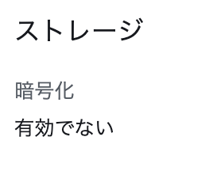

# `第１０回課題（３）`
## 課題
- CloudFormation を利用して、現在までに作った環境をコード化しましょう。
  - コード化ができたら実行してみて、環境が自動で作られることを確認してください。
- 結果を Discord で報告してください。

## RDS
RDSを作成する。
1. 順序はサブネットグループの作成  
1. セキュリティグループの作成  
1. RDSインスタンスの作成

でやっていく。  
セキュリティグループが複雑なので大変そう。  
RDSの細かい設定も大変そう。  

### サブネットグループの作成
```yml
  DBSubnetGroup:
    Type: AWS::RDS::DBSubnetGroup
    Properties: 
      DBSubnetGroupDescription: Created from the CloudFormation
      DBSubnetGroupName: !Sub ${ProjectName}-DBSubnetGroup
      SubnetIds: 
        - Fn::ImportValue: !Sub ${ProjectName}Id-Subnet-Pri-AZa
        - Fn::ImportValue: !Sub ${ProjectName}Id-Subnet-Pri-AZc
      Tags: 
      - Key: Name
        Value: !Sub "${ProjectName}-DBSubnetGroup"
```
AWS::RDS::DBSubnetGroupプロパティを[一覧で見る](resourcelist/AWS::RDS::DBSubnetGroup.md) 

DBSubnetGroupDescription:とSubnetIds:が必須  
説明なんていらないと思って消したらエラーになった。  


### セキュリティグループの作成

```yml
  EC2toRDS:
    Type: AWS::EC2::SecurityGroup
    Properties:
      VpcId: 
        Fn::ImportValue: !Sub ${ProjectName}Id-VPC
      GroupName: 'OutRDS@EC2'
      GroupDescription: !Sub Security group attached to instances to securely connect to ${ProjectName}_RDS. Modification could lead to connection loss.
      Tags:
        - Key: Name
          Value: !Sub "[${ProjectName}]OutRDS@EC2"

  RDSfromEC2:
    Type: AWS::EC2::SecurityGroup
    Properties:
      VpcId: 
        Fn::ImportValue: !Sub ${ProjectName}Id-VPC
      GroupName: 'InEC2@RDS'
      GroupDescription: !Sub Security group attached to ${ProjectName}_RDS to allow EC2 instances with specific security groups attached to connect to the database. Modification could lead to connection loss.
      SecurityGroupIngress:
        - IpProtocol: tcp
          FromPort: 3306
          ToPort: 3306
          SourceSecurityGroupId: !Ref EC2toRDS
      Tags:
        - Key: Name
          Value: !Sub "[${ProjectName}]InEC2@RDS"

  EC2toRDSSecurityGroupEgress:
    Type: AWS::EC2::SecurityGroupEgress
    Properties:
      GroupId: !Ref EC2toRDS
      IpProtocol: tcp
      FromPort: 3306
      ToPort: 3306
      DestinationSecurityGroupId: !Ref RDSfromEC2
```
AWS::EC2::SecurityGroupEgressプロパティを[一覧で見る](resourcelist/AWS::EC2::SecurityGroupEgress.md) 

 RDSに接続するEC2インスタンスにつけるセキュリティグループと、そのセキュリティグループがついているインスタンスからのインバウンドを許可するセキュリティグループ。  

単純に作ると循環依存になってしまうので、後からルールを追加する必要がある。  
パズルみたいで面白い。  

EC2toRDSは、EC2インスタンスにつけなければいけないが、このテンプレートでEC2toRDSをアウトプットして、EC2のテンプレートでアタッチした方が楽なのでそうすることにする。  
こっちもパズル的に解決する。  

S3も同じ解決方法で行こうとおもう。  

### RDSインスタンスの作成
```yml
  RDSInstance:
    Type: AWS::RDS::DBInstance
    Properties:
      DBInstanceIdentifier: !Sub ${ProjectName}-RDS
      DBInstanceClass: db.t3.micro
      Engine: mysql
      EngineVersion: "8.0.32"
      MasterUsername: admin
      MasterUserPassword: !Sub ${RDSPassword}
      DBSubnetGroupName: !Ref DBSubnetGroup
      AllocatedStorage: 20
      BackupRetentionPeriod: 0
      DBName: !Sub ${ProjectName}_RDS
      VPCSecurityGroups:
        - !Ref RDSfromEC2
      Tags:
        - Key: Name
          Value: !Sub "${ProjectName}-RDS"
```
AWS::RDS::DBInstanceプロパティを[一覧で見る](resourcelist/AWS::RDS::DBInstance.md)  

プロパティ一覧にVPCSecurityGroupsとDBSecurityGroupsがあるが、DBSecurityGroupsは今、使われていないらしい。循環参照のセキュリティグループを簡単に作れるのかと期待したけど、そうではなく、昔あったものが今もあるみたいな話だった。  
そして、VPCSecurityGroupsはAWS::EC2::SecurityGroupで作ったセキュリティグループのこと。ここら辺の名前は初見殺しすぎるので注意したい。  

#### データ保護について
[cfn-lint]が警告を出してくれていたので対応した。  
クラウドフォーメーションは削除が簡単なので、削除前にスナップショットを作るか、消さずに残すかを選べるらしい。   
```yml
DeletionPolicy: !Ref DeletionPolicy
UpdateReplacePolicy: !Ref UpdateReplacePolicy
```
プロパティでDelete、Retain、Snapshotを選べるようにした。  

同様にBackupRetentionPeriodも0ではなく入力できるようにした。  
```yml
BackupRetentionPeriod: !Ref BackupRetentionPeriod
```
こちらは制限なく入力可能だが、バリデーションはしていない。  

#### サブネットについて
AZを指定していないので、勝手にAZcへ作ってくれた。  
以下のプロパティを加えた。  

```yml
AvailabilityZone: !Select 
  - 0
  - !GetAZs 
    Ref: 'AWS::Region'
```
サブネットを作った時と同じようにAZを選択することができた。  

一応、パラメータセッションで選べるようにする。
```yml
  - !Sub ${SelectAZ}
```
[cfn-lint]が警告を出していたのでRefに変えた。  
```yml
  - !Ref SelectAZ
```
一応、Subでもできる。  

#### 暗号化について
出来上がったものを確認したら、ストレージの暗号化が無効になっていることがわかった。  
  
全く同じものを作るのであれば、有効にしてAWS KMS キーを設定する必要があるらしい。  
けど
```yml
Resources:
  KmsKey:
    Type: AWS::KMS::Key
    Properties:
      KeyPolicy:

  RDSInstance:
    Type: AWS::RDS::DBInstance
    Properties:
      StorageEncrypted: true
      KmsKeyId: !GetAtt KmsKey.Arn
```
やってない。  

AWS::KMS::Keyプロパティを[一覧で見る](resourcelist/AWS::KMS::Key.md)  

参考にしたサイト
CloudFormationで暗号化されたシングルAZのRDSを構築する方法：[https://qiita.com/kazunobu2211/items/2e60b363ae9c1e790b64](https://qiita.com/kazunobu2211/items/2e60b363ae9c1e790b64)


## [テンプレートの構造分析](https://docs.aws.amazon.com/ja_jp/AWSCloudFormation/latest/UserGuide/template-anatomy.html)
今更ながら、テンプレートの中身を確認する。  
テンプレートには、いくつかの主要なセクションが含まれている。

- AWSTemplateFormatVersion:
テンプレートが準拠している AWS CloudFormation テンプレートバージョン。'2010-09-09'しかない。
- Description:
テンプレートを説明する。このセクションは、必ず AWSTemplateFormatVersion セクションの後に記述する必要がある。  
- Metadata:
テンプレートに関する追加情報を提供するオブジェクト。
- Parameters:
実行時 (スタックを作成または更新するとき) にテンプレートに渡す値。テンプレートの Resources および Outputs セクションからのパラメータを参照できる。  
- Rules:
スタックの作成またはスタックの更新時に、テンプレートに渡されたパラメータまたはパラメータの組み合わせを検証する。  
- Mappings:
キーと関連する値のマッピングで、条件パラメータ値の指定に使用できる。ルックアップテーブルに似ている。Resources セクションと Outputs セクションで Fn::FindInMap 組み込み関数を使用することで、キーと対応する値を一致させることができます。  
- Conditions:
スタックの作成中または更新中に、特定のリソースが作成されるかどうか、または特定のリソースプロパティに値が割り当てられるかどうかを制御する条件。例えば、スタックが実稼働用であるかテスト環境用であるかに依存するリソースを、条件付きで作成できる。
- Transform:
サーバーレスアプリケーション (Lambda ベースアプリケーションとも呼ばれます) の場合は、使用する AWS Serverless Application Model (AWS SAM) のバージョンを指定する。変換を指定する場合は、AWS SAM 構文を使用して、テンプレート内のリソースを宣言できる。このモデルでは、使用できる構文と、その処理方法を定義する。
AWS::Include 変換を使用して、メインの AWS CloudFormation テンプレートとは別に保存されているテンプレートスニペットを利用することもできる。スニペットファイルを Amazon S3 バケットに保存すると、複数のテンプレートで関数を再利用できる。
- Resources:
唯一、必須のセクション。スタックに含める Amazon EC2 インスタンスや Amazon S3 バケットなどの AWS リソースを宣言します。
- Outputs:
スタックのプロパティを確認すると返される値について説明する。

AWS::KMS::Keyについて調べている時にMetadata:が出てきたので調べて、公式をコピペした。  
１０個あるセクションのうち、半分しか使っていなかった。  

パラメータの値はデフォルトに入れて固定していたので、不便さに気が付かなかったが、Metadataは必要だと感じたので採用した。  
１０個あるセクションのうち、過半数も使っている。  

Metadataのみの変更はできない。Metadataを追加・変更すると、変更した箇所がスタックの更新前に見られるので楽だと思ったら、中身自体の変更はないため更新ができなかった。  

参考にしたサイト  
あなたもできる！ CloudFormationテンプレートセッションまとめ ( 1 )：[https://dev.classmethod.jp/articles/lim-cfn-session-1-js/](https://dev.classmethod.jp/articles/lim-cfn-session-1-js/)


## 使用したリソース  
[AWS::RDS::DBSubnetGroup](https://docs.aws.amazon.com/ja_jp/AWSCloudFormation/latest/UserGuide/aws-resource-rds-dbsubnetgroup.html)

[AWS::EC2::SecurityGroupEgress](https://docs.aws.amazon.com/AWSCloudFormation/latest/UserGuide/aws-resource-ec2-security-group-egress.html)

[AWS::RDS::DBInstance](https://docs.aws.amazon.com/ja_jp/AWSCloudFormation/latest/UserGuide/aws-resource-rds-dbinstance.html)

</br>
</br>
</br>
</br>
</br>


<div style="text-align: center;">

[前へ](./lecture10-2.md)　／　[次へ](./lecture10-4.md)

</br>
</br>
</br>
</br>
</br>