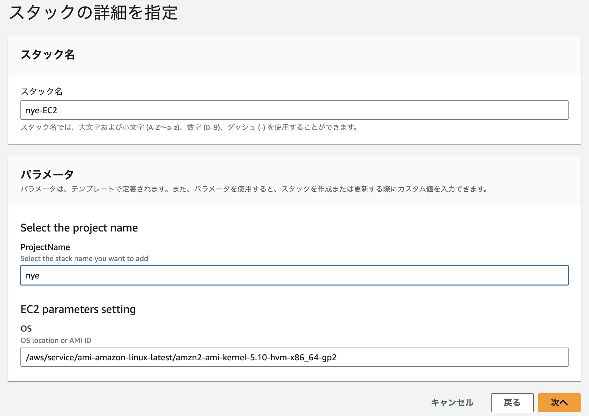

# `第１０回課題（４）`
## 課題
- CloudFormation を利用して、現在までに作った環境をコード化しましょう。
  - コード化ができたら実行してみて、環境が自動で作られることを確認してください。
- 結果を Discord で報告してください。

## S3
S3を配置する。  
予定では最後の工程になる。  

バケットポリシーがどうなるのか、EC2ロールをどうするのかが未知数。  

[lecture05-3](../lecture05/lecture05-3.md)を読んだらログでバケットポリシーを使っただけで、画像追加では使っていなかった。  
正直、ゴチャゴチャしていてわかりづらかった。

S3追加に必要なのは
- セキュリティグループ
- S3バケット
- IAMロール

この順番で作成する。  
IAMロールはここに書くが、テンプレートはEC2の方に記載する。  

### セキュリティグループの作成
```yml
  EC2toS3:
    Type: AWS::EC2::SecurityGroup
    Properties:
      VpcId: 
        Fn::ImportValue: !Sub ${ProjectName}-ID-VPC
      GroupName: 'OutS3@EC2'
      GroupDescription: Allow access to Amazon S3
      SecurityGroupIngress: []
      SecurityGroupEgress:
        - IpProtocol: tcp
          FromPort: 80
          ToPort: 80
          DestinationPrefixListId: pl-61a54008
      Tags:
      - Key: Name
        Value: !Sub "[${ProjectName}]OutS3@EC2"
```
AWS::EC2::SecurityGroupEgressプロパティを[一覧で見る](resourcelist/AWS::EC2::SecurityGroupEgress.md) 

S3 のマネージドプレフィックスリストを設定している点が初めまして  

手動デプロイの時はポート範囲を 0 - 65535 にしていたが、80だけで大丈夫だった。  

マネージドプレフィックスリストはそのままプレフィックスリスト IDを書けば良いらしい。  
プレフィックスリスト名だとエラーになった。  

### S3バケット
```yml
  S3Bucket:
    Type: AWS::S3::Bucket
    Properties:
      BucketName: !Sub ${ProjectName}.images
      Tags:
        - Key: Name
          Value: !Sub "${ProjectName}-S3-Bucket"
```
AWS::S3::Bucketプロパティを[一覧で見る](resourcelist/AWS::S3::Bucket.md)

プロパティは大量にあるけど、必須なのは名前だけだったので名前をつけた。  

### EC2インスタンスにロールを付与
参考にしたサイト  
【AWS】CloudFormationでEC2インスタンスに既存のIAMロールを設定する：[http://glasses-se-note.com/awscloudformationec2iam/](http://glasses-se-note.com/awscloudformationec2iam/)
```yml
  EC2Roles:
    Type: AWS::IAM::InstanceProfile
    Properties:
      Path: "/"
      Roles:
        - "S3FullAccess@EC2"

  EC2Instance:
    Type: AWS::EC2::Instance
    Properties:
      省略
      IamInstanceProfile: !Ref EC2Roles
```
AWS::IAM::InstanceProfileプロパティを[一覧で見る](resourcelist/AWS::IAM::InstanceProfile.md)  
AWS::EC2::Instanceプロパティを[一覧で見る](resourcelist/AWS::EC2::Instance.md)

AWS::IAM::InstanceProfileのRolesプロパティは ARN や インスタンスプロファイルの ARNを使ったりしたけどできなかった。  
!Ref S3FullAccess@EC2 もだめだった。

AWS::EC2::Instanceにインスタンスプロファイルの ARNだけつけてルカなとも思ったけど、これもできなかった。  

結局、調べて名前だけでできた。  
名前だけでいけるとは思わなかった。  

### 仕様
1. [VPC](CFn/VPC.yml)  
スタック名とCIDRPrefixを決める  
  
XXに入力したCIDRPrefixがそれぞれ入る  
  

1. [RDS](CFn/RDS.yml)
ProjectNameには追加したいスタック名を入れる  
  
SelectAZで、RDSを追加するAZが選択できる  
  
VPCで作成した上にRDSが作成される。(画像はSelectAZ=0のとき)  
  
画像にはないが、RDSとEC2の循環参照になっているセキュリティグループもこの時作成される  
1. [S3](CFn/S3.yml)
ProjectNameには追加したいスタック名を入れる  
  
RDSはなくても構わない。あくまでVPCに依存する  
  
画像にはないが、S3用のマネージドプレフィックスリストがソースになったセキュリティグループもここで作成される  
1. [EC2](CFn/EC2.yml)
ProjectNameには追加したいスタック名を入れる  
  
ロールを扱う場合チェックを入れる必要がある  
  
RDSとS3で作成したセキュリティグループがEC2につけられる  
  
画像にないこととしては、ALBのリスナーとターゲットがここで決まる。  
あと、EC2にはS3のフルアクセスをポリシーにもつロールが付与される。

この順番でスタックを作成する必要がある。（２と３に関しては逆でも可）  
極力ハードコードを避けたのでEC2以外はそこそこ使い回せると思われる。  
特にVPCはVPCを作成の時に選択できる「VPCなど」みたいな感じで使えると思う。  

RDSとS3はVPCのアウトプットを使うので少し制限されてしまうが、パラメータで選択できるのでそこそこ使えると思う。  
RDSは循環参照のセキュリティグループが名前だけでもどっちがどっちなのかわからなくなることがないから便利。  
S3も普通に作るよりはセキュリティグループもセットでできてお得。  

EC2は全てのアウトプットを集めて作成されるので少し使いずらそう。  
サンプル青売り用のEC2といった印象。  
でも個人的に、参照するものをわかりやすくしたつもりなので、コピペの雛形として使えそう。  

反省点・改善できるところ
- RDSの暗号化をしていない
- EC2のボリュームサイズが現在までに作った環境と全く同じではない
- VPCでEnvironmentNameをつけられるのに、そのパラメータを後に受け継ぐ仕組みが実装されていない
- もっとパラメータを選べてもいいかもしれない（EC2のOSとか）
- パラメータのバリデーションができていない
- SSHが0.0.0.0/0の全許可になっている（パラメータで変更できるかも？）


### 手動でデプロイ
環境の構築ができたので、およそlecture05の手順をなぞって、手動でデプロイした。  
使えないものを作ってもしょうがない。


クラウドフォーメーションで作成したキーペアはダウンロードできないし、ダウンロードしたものは無くしたら再発行しないといけないみたいだし、何のために作成するんだろうと思ったら AWS Systems Manager > パラメータストア で確認できた。  

参考にしたサイト  
EC2 キーペアのアップデート：[https://blog.serverworks.co.jp/update-ec2-keypair-20220429](https://blog.serverworks.co.jp/update-ec2-keypair-20220429)


Pumaだけ → Nginx-Puma → Nginx-Unicorn  
このステップを踏まずに、いきなりNginx-Unicornをやろうとしたら色々足りないものが出てくることが判明した。  

bin/devをしたら全て解決した。  


  
サンプルアプリが表示されて、画像のアップロードもできる。

  
S3も使える。

完成した。

## 使用したリソース  
[AWS::EC2::SecurityGroupEgress](https://docs.aws.amazon.com/AWSCloudFormation/latest/UserGuide/aws-resource-ec2-security-group-egress.html)

[AWS::S3::Bucket](https://docs.aws.amazon.com/ja_jp/AWSCloudFormation/latest/UserGuide/aws-properties-s3-bucket.html)

[AWS::IAM::InstanceProfile](https://docs.aws.amazon.com/ja_jp/AWSCloudFormation/latest/UserGuide/aws-resource-iam-instanceprofile.html)

[AWS::EC2::Instance](https://docs.aws.amazon.com/ja_jp/AWSCloudFormation/latest/UserGuide/aws-properties-ec2-instance.html)

</br>
</br>
</br>
</br>
</br>


<div style="text-align: center;">

[前へ](./lecture10-3.md)

</br>
</br>
</br>
</br>
</br>