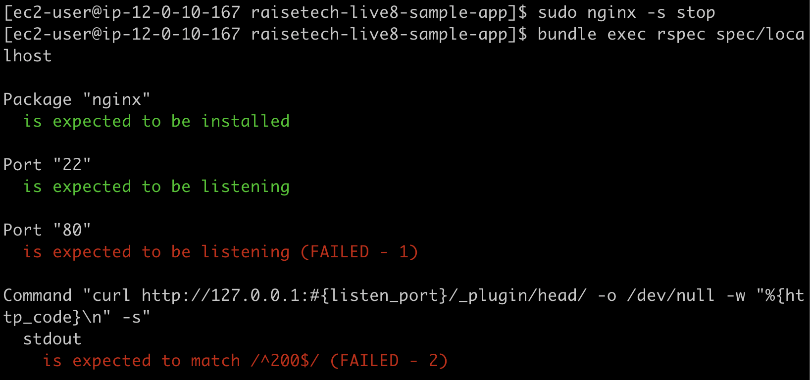

# `第１１回課題`
## 課題
- ServerSpec のテストが成功することを追加課題とします。  
  - サンプルを提供しますので、本日の授業を参考にカスタマイズしてみてください。  
  - テスト定義には決まった答えはないので、自由な発想で色々試してみましょう。


## ServerSpecとは
Rubyで書かれたサーバーのテストを行えるプログラム。  
人の手で行うテストをコードかすることによって、短時間でもれなく正確にテストを行うことができる。

## インストール方法
サンプルアプリケーションの Gemfile に以下を追加する。 
> gem 'serverspec'

以下を実行すると、Gemがインストールされる
```sh
bundle
```


## テスト方法
以下を実行
```sh
serverspec-init
```

以下のような表示になる  
> Select OS type:  
> 
>   1) UN*X
>   2) Windows
> 
> Select number: 1
> 
> Select a backend type:
> 
>   1) SSH
>   2) Exec (local)
> 
> Select number: 2

すると  
raisetech-live8-sample-app/spec/localhost/sample_spec.rb  
が作成されるので、sample_spec.rbを以下のコードに置換する。

```rb
require 'spec_helper'
require 'serverspec'

set :backend, :exec

describe package('nginx') do
  it { should be_installed }
end

describe port(22) do
  it { should be_listening }
end

describe port(80) do
  it { should be_listening }
end

describe command('curl http://127.0.0.1:#{listen_port}/_plugin/head/ -o /dev/null -w "%{http_code}\n" -s') do
  its(:stdout) { should match /^200$/ }
end
```

以下を実行するとテストが開始される
```sh
bundle exec rspec spec/localhost
```
## まとめ
Nginxだけをインストールしてテストファイルを実行すると、ポート８０と最後のローカルホストにアクセスできるかのテストはどちらも、Nginxを起動すると成功、停止すると失敗になることを確認した。  
  

  
Nginxのウェルカム画面が表示されているためだと予想した。


## 問題点
unicornを起動・停止したらどうなるのかと思い、bin/setupを実行した。  
以下の表示で止まってしまう。  
> == Preparing database ==
> Running via Spring preloader in process 4428

そんなわけはないとは思うが、Serverspecが実行できる環境でデプロイはできないらしい。  
エラーも出ないので削除して作り直した。

デプロイしてからunicornを起動して、画像のアップロードができるか確認後、Serverspecのテストファイルを実行するためunicornを停止した。(unicornのデーモン化をせず、ターミナル画面がひとつだから)

結果は、80は成功。ローカルホストはエラー  
502 Bad Gatewayにしてから実行した結果  
 

予想通りの結果を確認後、unicornを起動して両方とも成功になるか確認しようとしたところ、unicornが立ち上がらなくなった。

エラーを見るとSystemStackErrorだった。  
 


SystemStackErrorは、参照した先に参照するものがあって、その参照先にもさらに参照があって、、、と繰り返されていくことによって参照することに疲れたコンピュータが悲鳴を上げるエラーということらしい。  

課題はテストの実行ができればいいとのことなので、ここの課題はここで終わる。  

先の課題のCircleCIで調整等を行うらしい。  


## 感想
/fruits/newとかつけてテストしたいとか思っていたのにUnicornが使えないから無理だった。  
ImageMagick がないと画像の表示ができないからこれがインストールされているかテストするのもいいかもしれない。  
先にある課題ではやってみたい。

